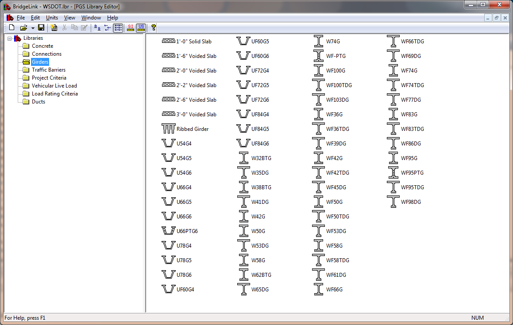
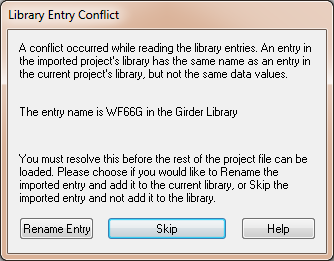

Library Editor {#library_editor}
==================================
The main window of the PGS Library Editor is split into two panes. The left pane has a list of the various libraries and the right pane shows the entries in each library. Select a library name in the left pane to show its entries in the right pane.

The figure below shows the Library Editor view with the Girder library selected.

Managing Library Entries 
------------------------
The Library Editor view is used to manage the library entries. Here you can create, edit, and delete the individual library entries.

> NOTE: Master Library entries are locked and cannot be changed from within PGSuper and PGSplice. Since the Master Library is shared, and entries are referenced into projects, chaos will ensue if individual users could change entries that are referenced to other user's projects.

### Creating New Entries ###

To create a new library entry:
1. Select *Library > Add New Entry*. This will create a new entry and place an icon in the library view.
2. See Renaming Entries to give the entry a meaningful name
3. See Editing Entries to edit the library entry parameters.

### Copying Entries ###

It is generally easier to copy an existing entry that it is to create a new one. To copy a library entry:
1. Select the library entry you wish to copy
2. Select *Library > Duplicate Entry*. A copy of the entry will be made and an icon placed in the library view.
3. See Renaming Entries to give the entry a meaningful name
4. See Editing Entries to edit the library entry parameters.

### Renaming Entries ###

New library entries and copies of existing entries are given names that aren't very meaningful. To rename a library entry:
1. Select the library entry you wish to rename
2. Select *Library > Rename Entry*
3. An editing field will activate next to the entry's icon. Type in the new entry name

### Editing Entries ###

Once you have created or copied an entry, and given it a meaningful name, it is time to edit the input parameters. To edit a library entry:
1. Select the library entry you wish to edit
2. Select *Library > Edit Entry*. This will display the entry's editing window. Edit the desired information for the library entry. For specific information about an entry's parameters, press [Help].
3. Press [OK] to commit your changes, or [Cancel] to close the editing window making any changes.

> TIP: You can edit an entry by double clicking on it. 

> TIP: You can view entries from the Master Library by following the Editing Entries procedure. Use the [Close] button to close the editing window. 

### Deleting Entries ###

Every now and then, you may want to delete a library entry you no longer need. You cannot delete Master Library Entries or Project Library Entries that are in use. The lock icon indicates the library entry is a member of the Master Library. The check icon indicates that the library entry is currently in use.

To delete a library entry:
1. Select the entry you wish to delete
2. Select *Library > Delete Entry*

### Importing Entries ###

You've taken a lot of time to set up library entries in one of your projects, and now similar project has come across your desk. How do you get the Project Entries from one project into another? You import them.

To import Project Entries into your current project:
1. Select *File > Import Library Entries*.
2. Using the Open dialog, find the project file that contains the entries you wish to import
3. Select the file and press [Open]. The entries will be imported into your project.

Library Entry Conflicts 
--------------------------
When importing library entries from an external source the possibility exists that the external source has a library entry with the same name, but different values, than an entry in your Master Library file. When that happens a Library Entry Conflict has occured. You are presented with the Library Entry Conflict window and you must decide how to resolve the conflict.

You have two choices for resolving the conflict. Rename the entry that is being imported so it no longer conflicts or skip the entry.

