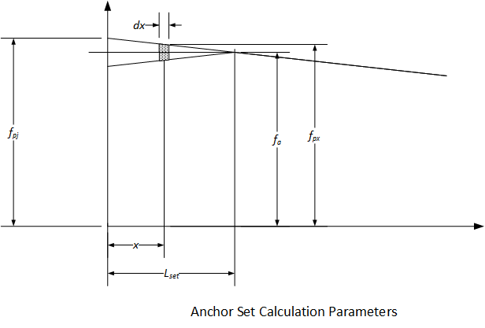

Anchor Set and Seating Losses {#tg_anchor_set}
==============================
After tendons are stressed they are anchored with a conical wedge system. The tendon retracts when it is released and pulls the wedges into the anchorage device. This forces the wedges together and locks the tendon in place. 

The tendon force after seating losses is show below

The stress loss due to seating is computed using an iterative process. 
1. Estimate the length of the region affected by the tendon retraction, Lset
2. Get the force in the tendon at Lset, Pa
3. Compute the length of the affected region as 
4. Revise the estimate of Lset and repeat until convergence

The figure below illustrates the parameters used to compute Lset

The seating loss is computed as

