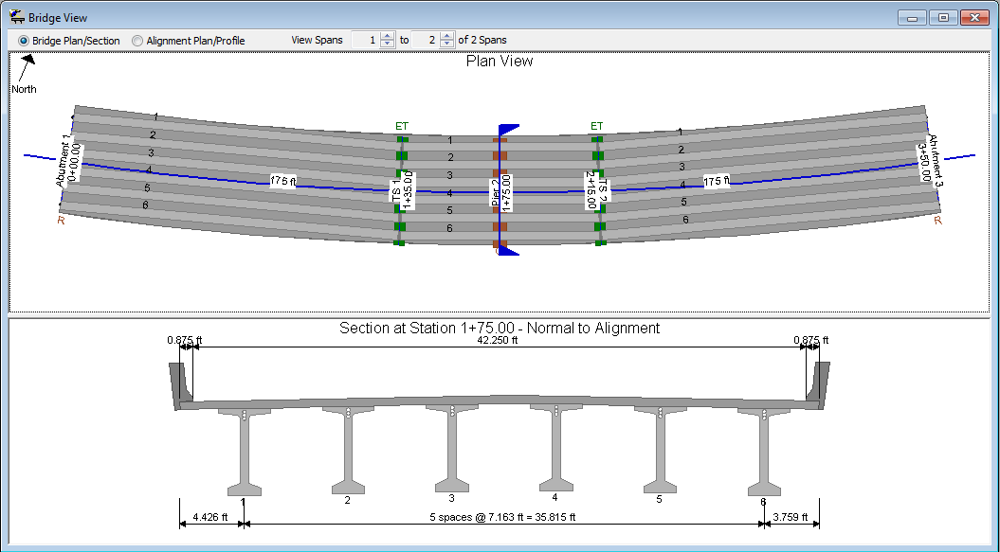

Curved Spliced Girder Bridges {#tg_curved_spliced_girder_bridges}
======================================
> NOTE: **TORSIONAL EFFECTS ARE NOT CONSIDERED IN THE SPLICED GIRDER ANALYSIS**

PGSplice has robust geometric modeling capabilities. The roadway alignment is a critical element in defining the overall geometry of the structure.

Curved spliced girder bridges are easily modeled with PGSplice, however, must be small enough that torsional effects are negligible.

> NOTE: **TORSIONAL EFFECTS ARE NOT CONSIDERED IN THE SPLICED GIRDER ANALYSIS**

Friction loss at the angle point between precast segments is taken into account during the time-step analysis.

> NOTE: **TORSIONAL EFFECTS ARE NOT CONSIDERED IN THE SPLICED GIRDER ANALYSIS**

