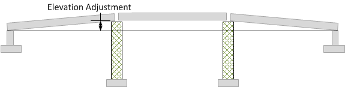

Deflections and Elevation Adjustment {#tg_deflections}
======================================
Deflections are measured relative to a zero datum line. The displacement of spliced girders can be modified by applying elevation adjustments to segment ends at temporary supports. Consider a single span bridge comprised of three segments. The segments are supported by the abutments and two erection towers. The segment ends can be raised at the erection towers to compensate for the downward deflection of the girder. The adjustment is defined as the Elevation Adjustment and is a rigid body displacement of the girder segments.

The total displacement of the girder is the sum of the deflections and the rigid body displacements.