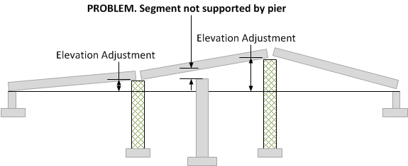

Deflections and Elevation Adjustment {#tg_deflections}
======================================
Deflections are measured from a straight line connecting the bridge piers. The deflected shape of spliced girders can be modified by applying an elevation adjustment. Consider a single span bridge comprised of three segments. The segments are supported by the abutments and two erection towers. The segment ends can be raised at the erection towers to compensate for the downward deflection of the girder.The adjustment is defined as the Elevation Adjustment.

Caution must be used when applying elevation adjustments to segments that have more than two points of support. The elevation adjustments must result in a straight line through all of the support points.

