Deflections {#tg_deflections}
======================================
Deflections are computed using linear elastic analysis and superposition of results.

Mapping of Permanent Segment Deformations from Segment Storage to Bridge Model Deflections
------------------------------------------------------------------------------------------
Girder Segments are not perfectly straight elements when placed at erection. They are shaped with permanent unrecoverable deformations caused by prestressing forces, creep, shrinkage, relaxation, girder hardening (increase in modulus of elasticity during storage), and precamber.

These unrecoverable deformations must be accounted for when segments erected. Segments are placed on simple supports at the time of segment erection and deflection is typically computed as \f$ \Delta = \frac{5wL^4}{384E_cI}\f$. This computation does not take into considerations deflections that occur prior to erection and the change in the concrete elastic modulus with time.

**Definition:  Erection Deflection Datum (EDD)** – Discrete locations on a segment where unrecoverable (permanent) deflection of the segment is mapped into points of zero deflection at the time of erection. Unrecoverable deflection between EDD points is measured relative to the EDD line.

For example, in the figure below a segment is supported at its ends during storage at the casting yard. The unrecoverable segment deflection is zero at the segment ends. The segment is then hauled to the site and erected at different bearing support locations, which become the new locations of zero deflection (aka, the EDD’s). The deflected shape is translated into the new position at erection assuming a rigid body translation. Post-erection deflections relative to these lines of zero deflection are then be added to the unrecoverable deflections to determine the total deflection in the bridge model.

If, for example, the left end of the right adjacent segment (shown in the bottom of the figure) is fully supported by the left segment, then the unrecoverable deflection of the supported segment is mapped to the deflection at the supporting segment’s strongback bearings as shown.

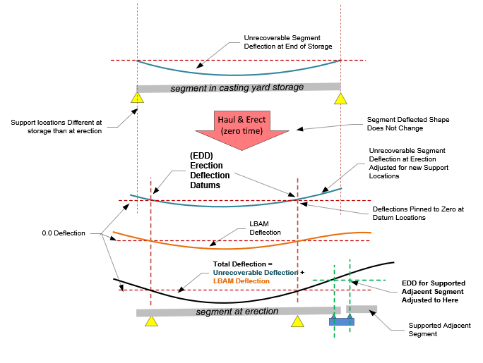

The sketches below show more examples how unrecoverable deflection is mapped at the EDD locations.

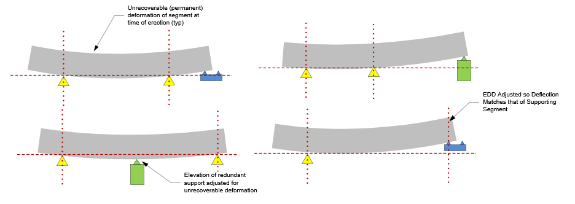

EDD datum locations are always at erection supports (pier, tower, or strongback) and there are exactly 2 per segment. Any additional supports on the segment are redundant, and their elevation at time of erection is adjusted based on the unrecoverable deflection at their location.

Unrecoverable Deflections Due to Change in Modulus During Storage
----------------------------------------------------------------------
Changes in support locations between storage and erection induce changes in dead load deflections that are superimposed on the unrecoverable dead load deflection. For example: a segment may be supported 5 ft inboard from its ends during storage causing a dead load deflection for this configuration. During storage the concrete ages and the modulus of elasticity increases. When the segment is moved to its erected configuration to different support locations, say 1 ft inboard from the ends, some but not all of the initial dead load deflection is recovered. This additional deflection in the erected configuration due to the change in support location is superimposed with the unrecoverable deflection, resulting in the total dead load deflection in the erected configuration.

Rules for Locations of Erection Deflection Datums (EDD’s)
----------------------------------------------------------
The locations of EDD’s are determined automatically using the following rules.

Legend:

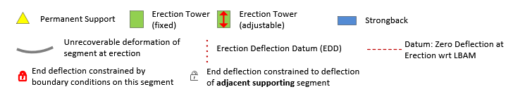

1) Rules are executed based on support conditions at erection of segment in question

2) If a segment is supported by 2 or more permanent piers, then both EDD locations are at the two outermost permanent piers 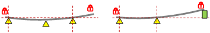

3) If a segment supported by 1 permanent pier:
    3a) and no erection towers, place the EDD at pier and strongback 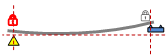
    3b) and one or more erection towers all on same side of pier:
	    3b.i) if tower(s) on side of pier with adjacent segment with free end, place EDD at outermost tower. Allow tower adjustment if free to move 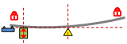 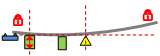 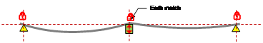
	    3b.ii) if tower on side of pier with a supporting adjacent segment, Place EDD at strongback, or tower if tower at closure 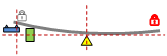 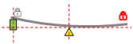
    3c) and more than one erection tower, and towers on both sides of pier: Place single EDD at Pier, allow outermost towers to be adjustable in co-dependent seesaw motion. Any redundant towers go along for the ride. Segment rotation is independent of adjacent segment BC’s. 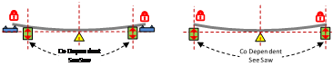

4) If a segment is not supported by permanent piers:
    4a) If not supported by erection towers, place EDDs at strongbacks 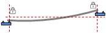
    4b) If supported by one erection tower:
        4b.i) and both ends of segment are dependent on adjacent segments, place EDD’s at strongbacks and adjust tower elevation for unrecoverable deflection 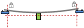
        4b.ii) one only one end of the segment is dependent on adjacent segment, place EDD at tower and at supporting strongback 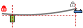
    4c) If supported by two or more erection towers: 
	    4c.i) and adjacent segments at both ends are free, place EDDs at outermost towers 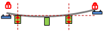
        4c.ii) and both segments ends are dependent on adjacent segments, place EDD’s on strongbacks and adjust tower elevations for unrecoverable deflection 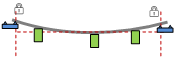
        4c.iii) and one segment end free and other is dependent on adjacent segment, place EDD at strongback at dependent end, and other EDD at closest tower to free end 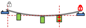

5) Additional rules for Erection Deflection Datums:
    5a) Deflections at free ends of drop in segments are made to match deflection of adjacent supporting segment
    5b) A mismatch in end deflections can occur when segments with fully constrained ends are placed adjacently. This mismatch must be checked if post-tensioning through joint 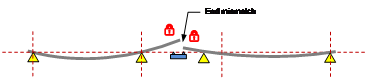 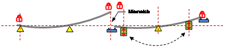

Deflections and Elevation Adjustment
------------------------------------
Deflections are measured relative to a zero datum line. The displacement of spliced girders can be modified by applying elevation adjustments to segment ends at temporary supports. Consider a single span bridge comprised of three segments. The segments are supported by the abutments and two erection towers. The segment ends can be raised at the erection towers to compensate for the downward deflection of the girder. The adjustment is defined as the Elevation Adjustment and is a rigid body displacement of the girder segments.
 

The total displacement of the girder is the sum of the deflections and the rigid body displacements.

> NOTE: The elevation adjust feature has been disable in this version of PGSplice and is being improved for the next version.