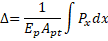

Elongation {#tg_elongation}
====================================
When the jacking force, Pj, is applied at the stressing end, the tendon will elongate. The elongation is computed as

where
<table border=0>
<tr><td>D</td> 
    <td> = elogation</td></tr>
<tr><td>Ep</td>
    <td>= modulus of elasticity of the tendon</td></tr>
<tr><td>Apt</td>
    <td>= cross-section area of the tendon</td></tr>
<tr><td>Px</td>
    <td>= tendon force at distance x from the jacking end</td></tr>
</table>
 
 
 