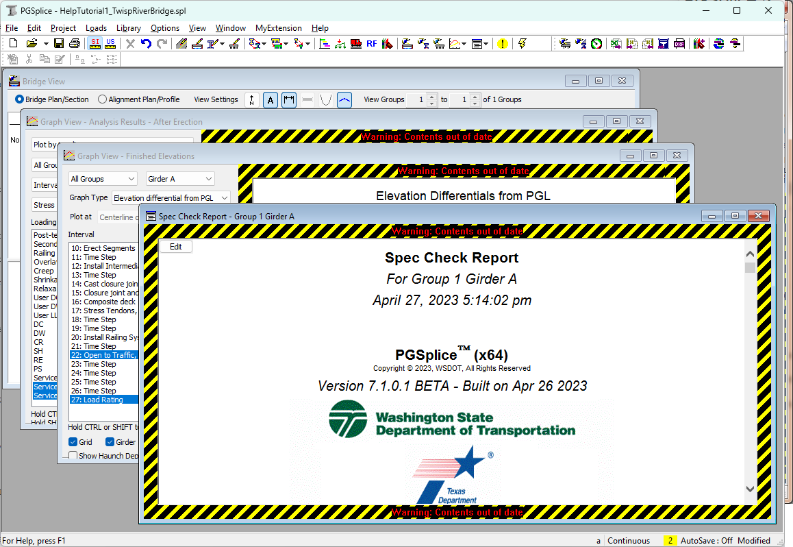

Learn about AutoCalc Mode {#tutorial_general_autocalc_mode}
==============================
You probably noticed that PGSplice updates reports and graphs on its own. You never had to tell PGSplice to get to work. The software knows that when you want a report or a graph that you expect results. PGSplice gets to work and does whatever calculations are necessary to create your report or graph. This is AutoCalc (automatic calculation) mode. You simply create graphs and reports for the information you are interested in and PGSplice does whatever work is necessary to satisfy these requests.  Any results that are being displayed are automatically updated when your model changes. This is part of the _Bridge-centric_ user interface. AutoCalc mode enables you to focus on the bridge and the analysis. The commands needed to produce output become secondary in your thought process.

AutoCalc mode is a bit cumbersome with the time-step analysis method. The lag time between editing the bridge and refreshing a report may be too long. These delays interfere with your thought process. If this is the case for you, AutoCalc mode can be disabled.

Disabling AutoCalc Mode
-------------------------
Select *Options > Turn AutoCalc Off*. This will turn off the AutoCalc mode. If you look at the status bar in the lower right corner of the application window, you will see status of the AutoCalc mode.

 

Repeat this step to turn AutoCalc mode back on. You will notice that the menu selection will change to Turn AutoCalc On.

> TIP: To toggle the AutoCalc mode on and off, you can double click on the AutoCalc field in the status bar.

Outdated Results
------------------
Now that the AutoCalc mode has been turned off, the graphs and reports will not automatically update. It is important to keep you informed at all times of the status of the information being displayed. Out of date analysis results are framed with a warning indicating the information presented on the computer screen does not represent the current state of the bridge model.

### Recognizing Out of Date Information ###
1. Before we can see the warning label, we need to edit the bridge model so the analysis results get out of date. Select *Edit | Bridge...*
2. Select the Railing System tab.
3. Change barriers to "32" F Shape".
4. Press [OK]

Notice the warning labels that frame the report and analysis results windows.

The next step is to update the analysis results.

### Updating Analysis Results ###
1. Select *Project > Update Now*. PGSplice will start doing the work needed to do to update any out-of-date results.

> TIP: You can press the F5 key to update out of date analysis results

