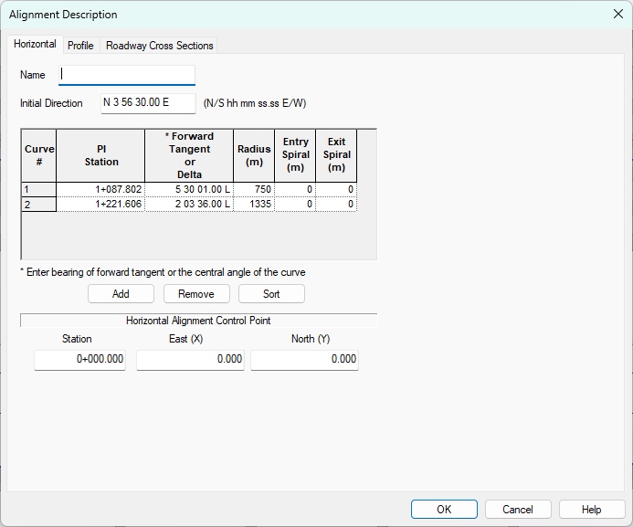
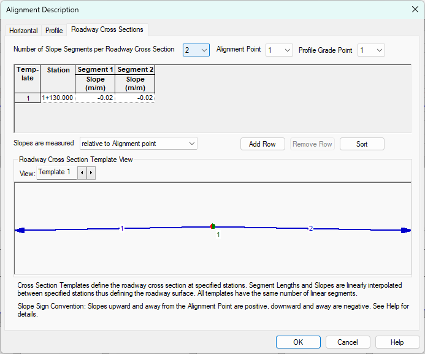
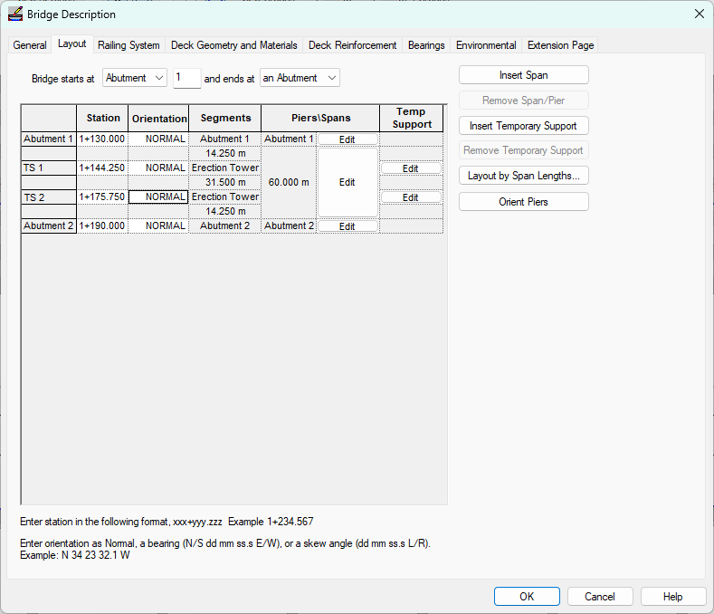
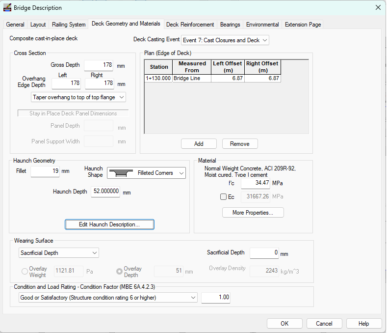

Editing the Bridge Model {#tutorial_general_editing_the_bridge_model}
==============================
The bridge modeled in the 1 Span template isn't exactly what we need. In the next few sections you will learn how to setup the roadway alignment and profile, locate the bridge piers, and establish the framing plan for the bridge girders.

Units
-----
The Twisp River Bridge was designed in  1999. Remember 1999? That's right, the US was trying to transition to the SI system of units. We will be working in SI units for this tutorial.

To work in SI units:

1) Select *Project > Units...*

 

2) Select SI Units.

3) Press [OK].

Roadway Alignment and Profile
-----------------------------
No matter how you slice it, highway bridges are part of the road. Since PGSplice is based on the assumption that you are working with a real bridge, there must be a real roadway that defines the geometry of the structure. We start describing our project by entering information about the roadway alignment.

### Describing the Alignment ###
1) Select *Edit > Alignment...*. This will bring up the Alignment Description Window. 
2) Select the Horizontal tab. Enter the information shown below. Press [Add] to add horizontal curves to the alignment. A horizontal control point can be input for coordinate geometry calculations. The default values are sufficient for this example. 

 
3) Select the Profile tab. Enter the information shown below. If this project had vertical curves, they would be entered on this tab. 

4) Select the Superelevations tab. Enter the information shown.

> NOTE: The bridge geometry is parametrically linked to the roadway alignment. The bridge geometry will automatically update if the alignment changes.

Bridge Framing
--------------
Now that the roadway geometry is defined, we will define the bridge beginning with the piers and abutments. The piers and abutments are where the bridge geometry intersects the roadway geometry. The locations of the piers establish the location of the bridge along the alignment.

### Defining the Bridge ###
1) Select *Edit > Bridge...*. This will bring up the Bridge Description window. The general bridge information is described on the General tab. Since our bridge has a very simple configuration, most of the details of the framing can be described on this tab. The project template gets us very close with the bridge configuration. The only changes that need to be made are the Bridge Line Offset and the Girder Spacing. Enter the values shown below. 

2) Select the Layout tab. This is were the piers are located and oriented. Enter the information shown below by either entering it directly into the grid. 

3) We will use the default Railing System defined in the template. However, if we needed to use a different railing or traffic barrier, define a sidewalk, or add an interior pedestrian barrier, this could be done on the Railing System tab.

4) Select the Deck Geometry and Materials tab. This is where we will describe the bridge deck. The cross section, material, and wearing surface input are self-explanatory. The Plan (Edge of Deck) input needs a bit more explanation. In PGSplice, the deck width is described by the distance from the Alignment or the Bridge Line to the left and right edges. For constant width decks with edges that parallel the alignment, the left and right deck edge offset only needs to be defined at one location. For our bridge, enter the edge of deck input shown below. 

Click on the *Edit Haunch Description...* button, and change the haunch depth to *Same for Entire Bridge*, distributed *Uniformly*, set the single value to 52mm.

This completes the description of the bridge.

Press [OK]. Notice that the Bridge Model View is updated to reflect the current project data. With the exception of the application of user-defined loads, we are done with the input.

> NOTE: More complex bridges can be modeled in PGSplice, for example multiple span bridges with cantilever pier segments and drop in field segments can be modeled.

> NOTE: Bridge decks with complex geometry can be easily described in PGSplice. By entering the deck edge offset at various stations and the transitions between these offsets, many different types of deck geometry can be modeled. The deck edge can be transitions between the edge points with a Parallel transition (deck edge is parallel to alignment between points), linear, or a spline curve.
