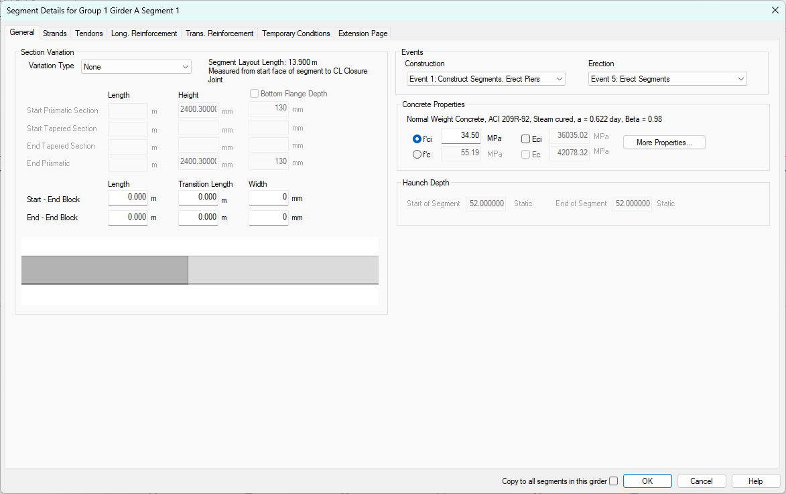
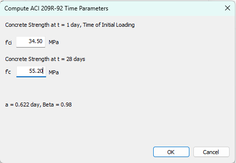
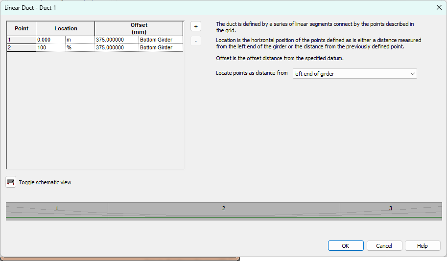
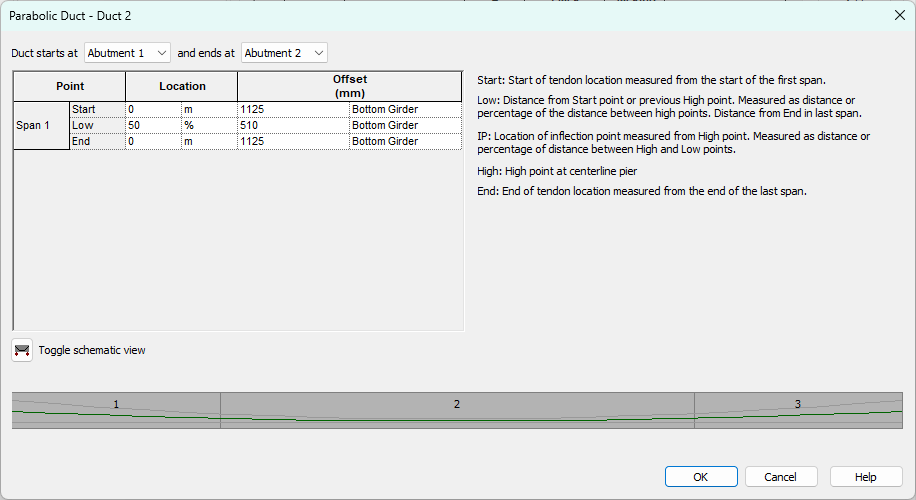
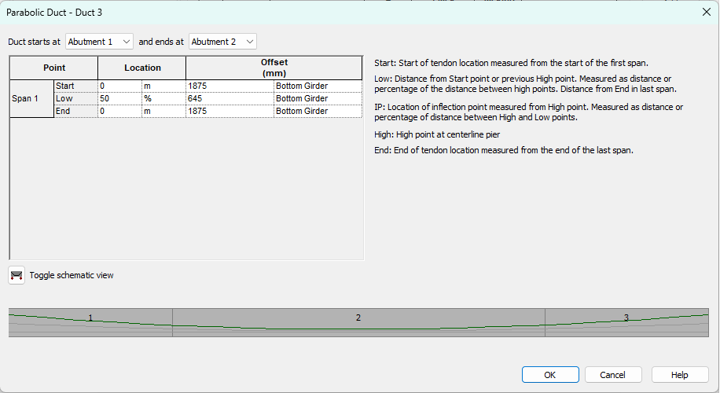

Editing the Girders {#tutorial_general_editing_the_girders}
==============================
Next we will define the girders.

1) Select *Edit > Girder*
2) Select Group 1, Girder 1 for editing 

3) This will open the Girder Details window.

All of the information that defines a girder can be accessed from the Girder Details window.

The list of segments and closure joints provide access to the details of each of these components.

The list of ducts defined the duct geometry and the prestressing tendon.

The girder drawing shows the segments and duct profiles for rapid feedback and visual validation of the geometric parameters.

Defining Material Properties
--------------------------------------
We are going to define material properites of the segments and closure joints. 

Press [Edit] for Segment 1. This will open the Segment Details window.

You'll notice at the bottom of the General tab that we can't input both f'ci and f'c. This is because we are using time-dependent material models from the ACI 209R-92 or CEB-FIP 1990 codes. The time-dependent concrete models are defined by time variation parameters and a single concrete strength at a specified time.

> NOTE: See @ref ug_girder_modeling_defining_concrete in the @ref user_guide for more information.

However, there is a way to fit the time-dependent concrete strength curve through two concrete strengths.

Press [More Properties...] to open the Concrete Details window and select the ACI 209R-92 tab.

> TIP: AASHTO LRFD does not provide a time-dependent concrete model so the model from ACI 209R-92 is used. See @ref tg_time_dependent_material_models in the @ref technical_guide for more information.

Remove the check from the _Use time parameters from ACI 209R-92..._. This will allow use to enter our own time-parameters. 

Press [Compute Time Parmeters...] and enter f'ci and f'c for the segment.

Press [OK] and the time-parameters will be computed.

Press [OK] again and the concrete definition for the segment will be complete.

Before pressing [OK] to close the Segment Details window, check the "Copy to all segments in this girder" box next to the [OK] button. By doing so, all of the details of this segment will be copied to all of the other segments in this girder. 

Press [OK] to complete editing the segment.

The process needs to be repeated for the closure joints. Press [Edit] for the Closure Joint between Segment 1 and Segment 2. Be sure to check the "Copy to all closure joints in thei girder" box to apply the properties to all the closure joints.

Defining Prestressing and Reinforcement
------------------------------------------
We will return to Segment 1 to define it's reinforcement. Press [Edit] for Segment 1.

### Defining Prestressing ###

Select the Strands tab.

Unlike PGSuper, in PGSplice potential strand locations are not defined in the Girder library. This is because the strand arrangements in spliced girder segments tend to be different based on their position within the structure. If this where a multiple span bridge with a cantilevered pier segment, the strands in the end segments and the pier segment would most likely be different even though all segments are of the same girder type.

This segment has debonded strands so we will have to enter two "rows" of strands. Enter the strand information shown above. Press [OK].

### Defining Longitudinal Reinforcement ###
The precast segments have 4, #4 bars 25 mm (clear) from the top of the segment. Select the Long. Reinforcement tab and enter the information shown below.

Repeat this process for segments 2 and 3.

Defining Ducts and Tendons
-----------------------------
Ducts and tendons are defined in the Ducts/Tendons grid. Use [Add] to add ducts. The general duct type and the tendon size and jacking force parameters are entered directly into the grid. Press [Edit] in the grid to edit the duct geometry. The duct geometry can be defined by a sequence of points and linear segments or by a parabola. We will use Linear for Duct 1 since it is straight and Parabolic for Ducts 2 and 3. Enter the duct geometry shown below and the tendon jacking force information shown above.

The girder is now completely defined. Check the "Copy to all girders in this group" box and press [OK].

