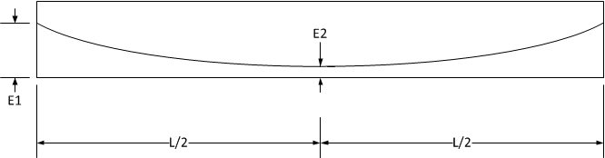

General Features {#general_features}
============
This tutorial highlights the major features of PGSplice. At times, we deviate from what might be considered "normal practice" to illustrate certain features. Please consider this tutorial a lesson on using PGSplice and not a lesson in spliced girder analysis.

In this tutorial you will:

1. @subpage tutorial_general_new_project
2. @subpage tutorial_general_editing_the_bridge_model
3. @subpage tutorial_general_editing_the_girders
4. @subpage tutorial_general_reviewing_results
5. @subpage tutorial_general_autocalc_mode
6. @subpage tutorial_general_getting_help
7. @subpage tutorial_general_wrapping_up

The Bridge
----------
One of the basic assumptions inherent in PGSplice is that you are analyzing a real bridge and not just a girder. It is assumed that you have either preliminary plans or a final set of PS&E sitting in front of you. The input for PGSplice reflects the information you will find on a typical set of bridge plans.

The example bridge for this tutorial is the Twisp River Bridge in SR 20 in Twisp, WA. This is a single span spliced girder bridge with a 60 m span. The details are given below:

Item | Description
-----|---------
Alignment | Initial Direction  N 3 56 30 E   Curve 1: PI 1+087.802, Delta 5 30 01 L, Radius 750 m  Curve 2: PI 1+221.606 Delta 2 03 36 L, Radius 1335 m
Profile |  Station : 1+100.62 Elevation : 491.093 Slope : -1.4336%
Crown Slope |  Left : -0.02 ft/ft  Right : -0.02 ft/ft
Pier 1 | Back of Pavement Seat : 1+130
Erection Tower 1 | 1+144.25
Erection Tower 2 | 1+175.75
Pier 2 | Back of Pavement Seat : 1+190
Girders | 6 - WF95PTG @ 2.100 m, Three segments each
Slab |  Gross Depth : 190 mm  Overhang : 1.620 m (6.87 m from CL Bridge to edge of deck) Slab Offset (aka Haunch or "A" Dimension) : 230 mm Wearing Surface (Sacrificial Depth) : 13 mm
Materials | Precast Segments: f'ci = 34.5 MPa, f'c = 55.2 MPa  Closure Joints: f'ci = 24.25 MPa, f'c = 34.47 MPa Deck: f'c = 34.47 MPa Strands : 15.24 mm Grade 270 Low Relaxation

The centerline of the bridge is 1.200 m left of the alignment.

Duct | Diameter (mm) | E1 (mm) | E2 (mm) | # Strands | Pjack (kN)
-----|---------------|---------|---------|-----------|--------------
1 | 115 | 375 | 375 | 19 | 3910
2 | 115 | 1125 | 510 | 19 | 3910
3 | 115 | 1875 | 645 | 19 | 3910

