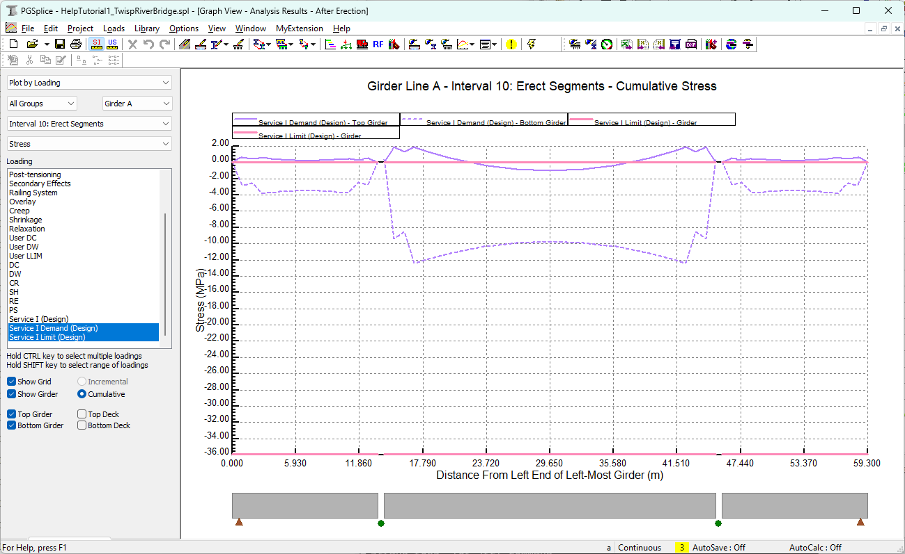

Reviewing Results {#tutorial_general_reviewing_results}
==============================
PGSplice has two robust facilities for reviewing results. Analysis results can be viewed graphically or in a report format. Let's explore the reporting features by looking at analysis results for the first exterior girder.

Creating the Spec Check Report
------------------------------
The Spec Check Report provides the details of a specification compliance check. The AASHTO criteria for service and strength limit states are evaluated as well as criteria for constructability, handling, and more.

To create the Spec Check Report
1. Select *View > Reports > Spec Chec Report*. This displays the Report Options window.
2. Select Group 1 and Girder A.
3. Press [OK] and the report will be automatically generated.

Reviewing the Spec Check Report
----------------------------
The Spec Check Report provides a detailed listing of the specification checks that were performed. The report starts with a summary so you know immediately if your girder has deficiencies. The summary is followed by the detailed specification checks that list the LRFD criteria, the allowable or required values, the provided or computed values, and a Pass/Fail status for the check. For many of the checks, a Capacity/Demand (C/D) ratio is computed.

For this particular example, we see that some of the specification checks did not pass. However, if we start to look at the details, most of the C/D ratios are very close to 1.0. This is a good sign as the original design was done based on the AASHTO Standard Specifications and simplified procedures for computing prestress losses. 

> TIP: The Table of Contents feature makes it easier to navigate reports. To view the Table of Contents, click the right mouse button over the report and select Table of Contents.

> TIP: You can search the report for keywords. To search the report, click the right mouse button over the report window and select the Find option. In the Find dialog, enter the search keyword or phrase.

Graphical Results
------------------
You can view a wide variety of graphical results. The most common results of interest are moments, shears, deflections, and stresses. You can also see graphical representations of girder properties, effective prestress, and more.

### Viewing Graphical Stress Results ###
1) Begin by opening the Analysis Results window. Select *View > Graphs > Analysis Results*. 

2) Use the controls along the left side of the Analysis Results window to select the various graphs that are available. Note that these graphs call also be printed. Go ahead and select some graphics now.

### Viewing Deformed Girder Elevations  ###
1) Begin by opening the Analysis Results window. Select *View > Graphs > Finished Elevations*. 
2) Select graph options to show finished deck vs PGL at service as shown. Note that the view shows elevations, but the results are not that useful.

3) Now switch the graph type to *Elevation Differential from PGL* and also show the elevation tolerance. We can now see that roadway elevations are acceptable at time of open to traffic.

> Tip: The *Fill Haunch Input with Computed Values"* feature can design a haunch layout for you. Give it a try to see how finished elevations change after the haunch has been designed.

Try selecting multiple other intervals along the timeline. This is useful for visualizing how your bridge will deform over time.

