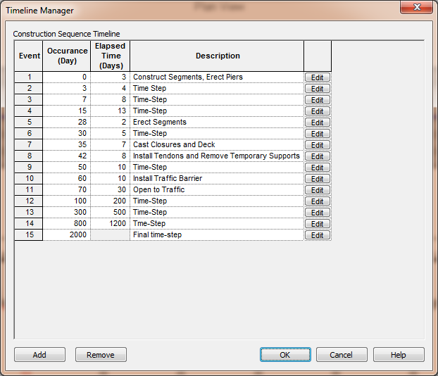

Learn about the Timeline Manager {#tutorial_timeline_learn_about_the_timeline_manager}
========================================================================================
The construction sequence is an important element of the time step analysis. Forces, stresses, and displacements change with time due to changes in material properties, structure topology, vertical elevation checks, loading conditions, and time dependent effects due to creep and shrinkage of concrete, and relaxation of strands and tendons. At design time you typically will not know the exact construction schedule the bridge builder will use. Assumptions about the timing and sequence of construction activities will have to be made at design time.

> NOTE: LRFD 5.12.3.4.1 (*pre-2017: 5.14.1.3.1*) "The method of construction assumed for the design shall be shown in the contract documents."

The construction sequence is modeled with a sequence of timeline events. Each event corresponds to one or more construction activities such as Erect Segment and Cast Deck. The Timeline Manager provides an overall view of the timeline and allows you to modify the timeline to fit your particular project and assumptions.

> TIP: The PGSplice Project Templates have a timeline that is ready to use. All you have to do is modify it to fit your project.

To open the Timeline Manager window:
1) Create or open a PGSplice project
2) Select *Edit > Timeline...*. 

As you can see from the image above, this timeline consists of 15 events. The first event begins on day 0 and the timeline ends at day 2000. The construction events consist of constructing segments and erecting piers, erecting segments, casting closure joints and the deck, installing the traffic barrier, and opening the structure to traffic. Intermediate events, called Time Steps, are provided between the major construction events to capture the non-linear time-dependent material responses.

> TIP: The duration of the timeline should theoretically encompass the design life of the structure, however it can be truncated once the time-dependent effects of creep and shrinkage of concrete and relaxation of prestressing strands have become negligable. 

The day when an event begins and the elapsed time to the next event can be entered directly into the Timeline Manager window grid. These are not independent variables, changing the beginning day of an event changes the elapsed time since the beginning of the previous event and changing the elapsed time changes the begining of all subsequent events.

The event description can be anything you like. You can enter the description directly into the Timeline Manager window grid. 

> TIP: Use an event description that captures the construction activities that take place during the event.

Events can be added or removed from the construction sequence with [Add] and [Remove].

The details of an event can be explored by pressing [Edit].

See @ref ug_construction_sequence in the @ref user_guide for a more detailed discussion of modeling the construction sequence.