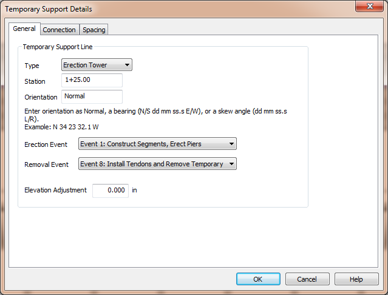
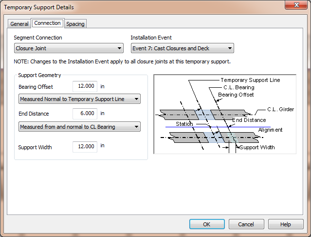
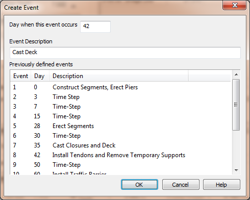
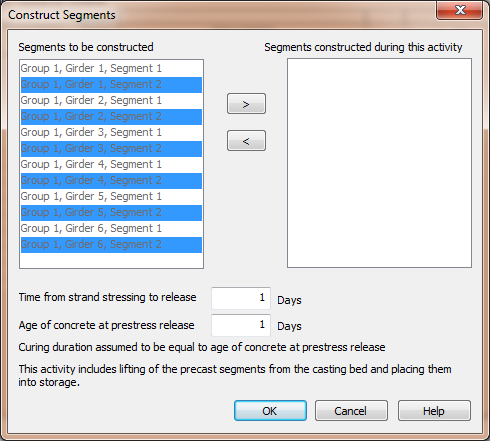
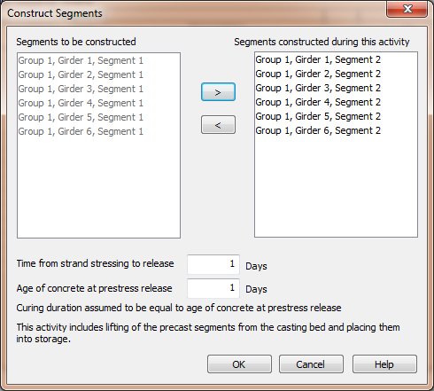
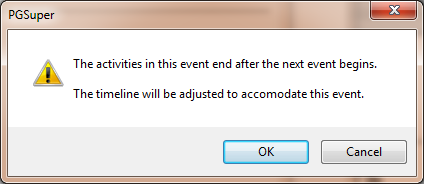
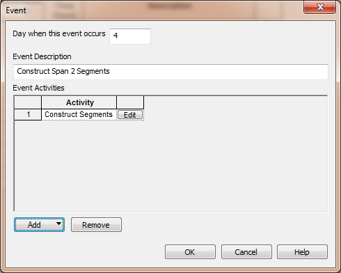
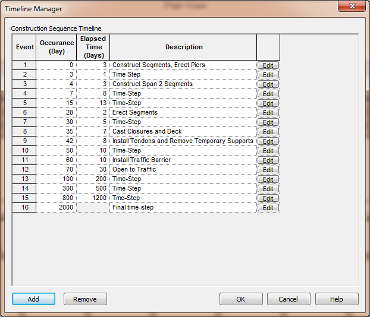

Select and Create Timeline Events {#tutorial_timeline_selecting_timeline_events}
========================================================================================
Erecting piers, constructing and erecting segments, casting closure joints and deck, installing traffic barriers, stressing tendons, and opening the bridge to traffic are construction activities that must be assigned to construction events. PGSplice offers two methods for assigning the various bridge components to the timeline; Direct Assignment and Timeline Editing.

> NOTE: When a bridge component is moved into an event, it is automatically removed from whatever event it previously belonged.

Direct Assignment
------------------
Bridge components can be directly assigned to the timeline while those elements are begin edited. The details windows for the bridge components have drop down lists of events. Simply select an event from the list to assign the component that is being edited to that event.

Let's look at the Temporary Support Details window for an example.

Open the Temporary Support Details window and select the General tab.

 

We need to model the construction events when the temporary support is erected and when it is removed from the  structural system. In the image above we see drop down lists for "Erection Event" and "Removal Event".

Now select the Connection tab. 

 

If the Segment Connection is "Closure Joint" we have to select an event that defines when the closure joint is installed.

Timeline event drop down lists are found on the editing windows for all of the bridge components including the precast-segments, girders, closure joint, railing system, bridge deck, and loading.

### Creating a Timeline Event ###
If the timeline does not quite fit your project, you can create a new timeline event directly from the drop down list.

The timeline for these tutorials has the closure joints and deck cast at the same time. Let's say that we want to cast the deck after the closure joints.

1. Select *Edit > Bridge...* to open the Bridge Description window.
2. Select the Deck Geometry and Materials tab
3. Select "Create Event..." from the Deck Casting Event drop down. This will open the Create Event window. 
4. In the Create Event window, we see a list of previously defined events. Closure Joint casting occurs on day 35 so we will create a new event called "Cast Deck" on day 42. 
5. Press [OK]. Notice that the deck casting event we just created is now the selected event in the drop down list.
6. Select "Create Event..." again. You'll see the new deck casting event is in the list of previously defined events events occuring on day 42 and all the subsequent events have been shifted in the timeline.
7. Press [Cancel] to close the window.

Timeline Editing
----------------
While the Direct Assignment method makes it easy to create events as needed and move individual bridge components between events, it does not provide you with event details and it is not convienent for assigning similar components, such as the precast segments, to the same event. Using the Direct Assignment method, you would have to edit every segment one at a time to change their construction and erection events.

The Timeline Editing method provides the event details and allows you to manipulate the events associated with all of the bridge components in one place.

The timeline for these tutorials have all the segments being constructed at the same time. Generally this is sufficient and it results in faster time-step analysis. However, for sake of example, let's assume we want to model segments being constructed at two different times.

1. Create a new 2 Span I-Beam project
2. Select *Edit > Timeline...*
3. Press [Add] to create a new timeline event.
4. Set the day of occurrence to 4 and enter an event description ("Construct Span 2 Segments" is a good choice).
5. Select *[Add] > Construct Segments*.
6. In the Construct Segments window, hold the CTRL key and use the mouse to select all Segment 2's from the "Segments to be Constructed" list 
7. Press [>] to move them to the "Segments constructed during this activity" list. 
8. Press [OK]
9. The new event has some duration and it doesn't fit into the current timeline. An message window tells you that the timeline will be modified to accomodate the new event. 
10. Press [OK] and the timeline will be adjusted.
11. The Construct Segment activity is now part of our event. 
12. Press [OK].
13. Our event is part of the overall timeline. 
14. Press [OK] to complete the timeline editing.

