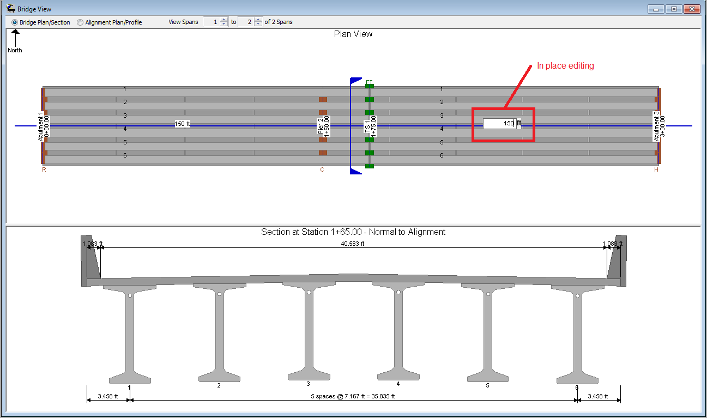
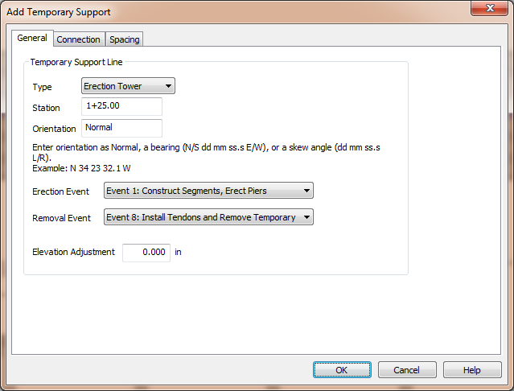
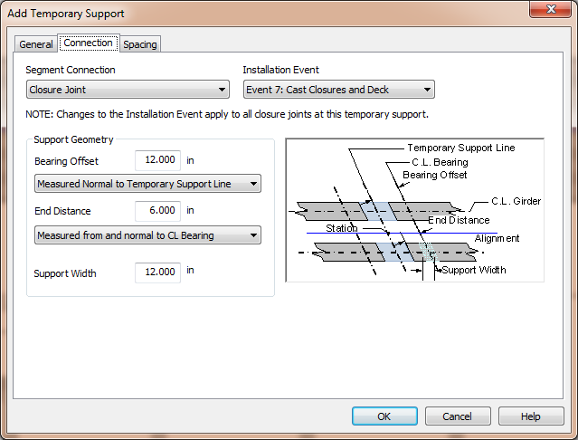

Editing the Bridge Model {#tutorial_variable_editing_the_bridge_model}
==============================
The bridge modeled in the 2 Span template isn't exactly what we need. Let's learn a couple new editing techiques and make this bridge model fit our example.

In Place Editing
------------------
Another unique element of the _Bridge-centric_ user interface is in place editing. We want span 2 to be 150 ft in length, so simply click on the span length (180 ft) and type in 150 ft. Press Enter and the span length is changed.

Creating an Erection Tower and Closure Joint
--------------------------------------------
The default bridge has two segments per girder and we need three. We also need an erection tower at Station 1+25. We will create the erection tower and use a Closure Joint connection which will break the first segment into two pieces.

1. Select *Edit > Insert Temporary Support*
2. On the General tab, change the station 1+75 
3. On the Connection tab, change the Segment Connection to Closure Joint and set the Installation Event to Event 7: Cast Closures and Deck 
4. Press [OK]

In the Bridge View, you'll see that we've added an erection tower and there are three segments per girder.

Selecting the Girder Type
--------------------------
The default girder type is a WF95PTG girder. This is a constant depth girder. We need to select a different girder type.

1. Select *Edit > Bridge*
2. On the General tab, change the girder type to WF-PTG.
3. Press [OK]

Now that the basic layout of the bridge and girder configuration is complete, we'll define the details of the variable depth pier segment.