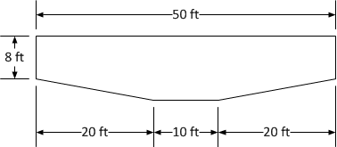
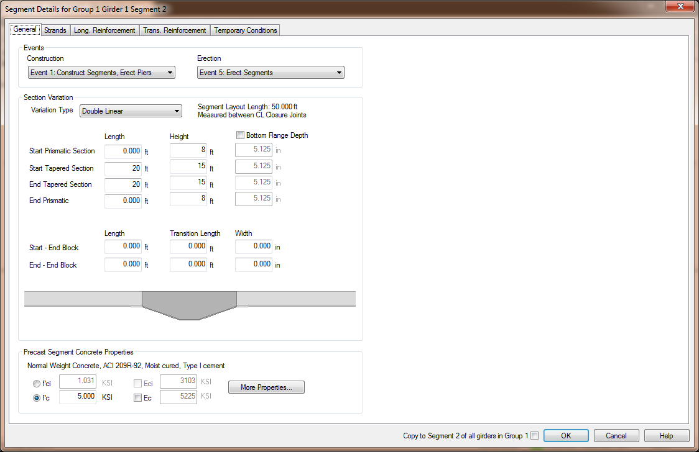
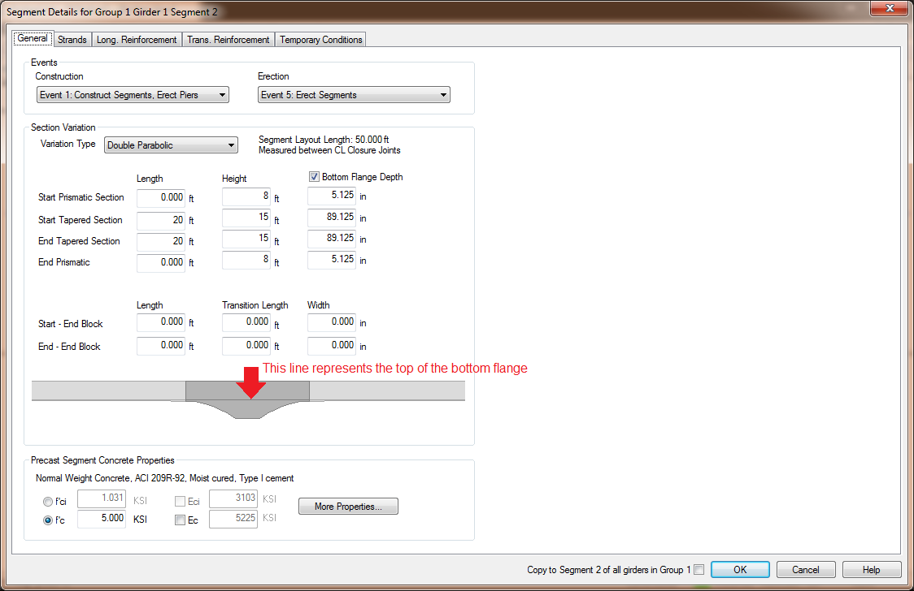

Editing the Girders {#tutorial_variable_editing_the_girders}
==============================
Now we will make the Segment 2, the segment at Pier 2, a haunched segment.

Let's make the depth of the segment taper from 8 ft at the ends to 15 ft near the center. The segment will be a constant 15 ft deep 10 ft on either side of the centerline of the segment to accomodate its interface with Pier 2.

> NOTE: The dimensions used in this example are for illustrative purposes only

1. In the Bridge View, double click on Segment 2 of Girder 1. This will open the Segment Details window for that segment.
2. Set the Variation type to Double Linear because we want two linear depth transitions.
3. Enter the segment dimensions as shown below. 

Notice that the graphic updates as you change the dimensions of the segment. You will see the shape of this segment as well as any modification to the shape of the adjacent segments. In this case, we changed the end depth of the segments from 7.875 ft to 8.0 ft. Since the adjacent segments must be the same depth, they will be changed to a Linear variation with the depth of 7.875 ft at the abutment ends at 8.0 ft at the ends adjacent to this segment.

The depth variation can be linear or parabolic. Change the variation type to Double Parabolic.

The depth of the bottom flange is constant. However, this girder type supports a variable depth bottom flange as well. Let's make the bottom flange thicker in this segment so that the depth of the thin portion of the web is constant.

1. Check the Bottom Flange Depth box.
2. Enter the bottom flange dimensions shown below. 