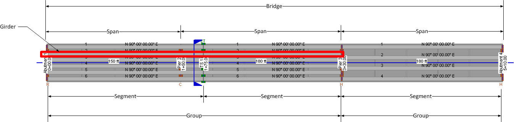

Nomenclature {#ug_bridge_modeling_nomenclature}
==============================================
The following nomenclature is used to describe the components of the bridge model.

Item | Description
-----|----------
Segment | An individual precast segment
Closure Joint | A cast-in-place concrete joint connecting segments together to form a girder
Girder | A sequence of segments and closure joints. A girder can be many spans in length.
Group | A group is a collection of side-by-side girders.
Span | That portion of the bridge between permanant piers
Permanent Pier | The permanent substructure elements of the bridge including abutments and intermediate piers
Temporary Support | Temporary works to support segments during construction including erection towers and strongback hangers
Bridge | The bridge consists of all the groups

In the image below, there are two groups. Group 1 consists of Spans 1 and 2 and there are 6 girders in the group. Group 2 consists of Span 3 and there are 4 girders in the group.

The girders in Group 1 consist of two segments and a closure joint. The segments are supported on the permanent piers Abutment 1, Pier 2 and Pier 3 as well as an erection tower Temporary Support. The girders in Group 2 have one segment.

