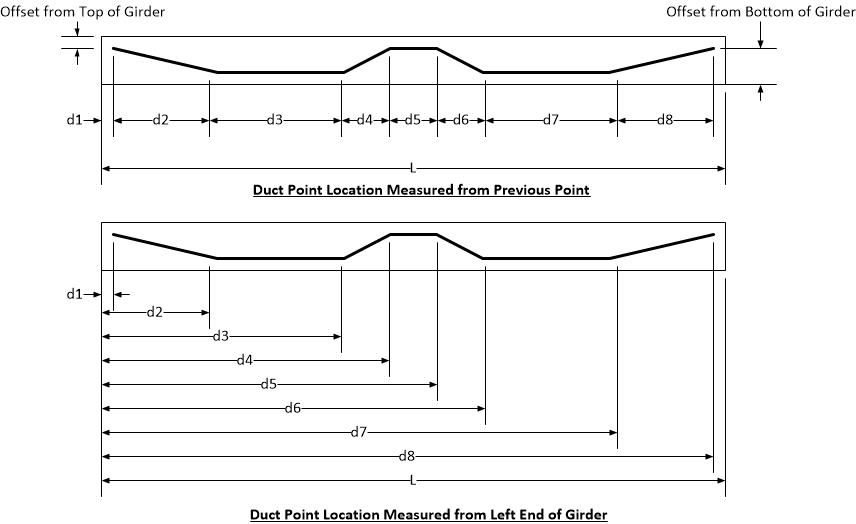

Linear Duct {#ug_dialogs_linear_duct}
==============================================
Define the geometry of the centerline of the duct with a sequence of duct points that are connected by linear segments.

The segments are defined by a sequence of duct points. The duct points are defined by their offset from the top or bottom of the girder and the horizontal position with respect to the left end of the girder or the distance from the previous point.

*Duct control point grid*

Item | Description
-----|-----------
Locate points... | Select the method for locating the segment poitns
Location | Enter the horizontal location of the duct point. Use the drop down list to select the unit of measure. Use "%" to locate the duct point as a percentage of the girder length.
Offset | Enter the offset of the duct point. Use the drop down list to select the offset datum.
[+] | Add a new duct point
[-] | Delete the selected duct point.

The duct layout, relative to the precast segments, is displayed and updated as the duct control points are changed. The vertical drawing scale can be toggled with the schematic view button.

> NOTE: The duct does not have to run the full length of the girder.