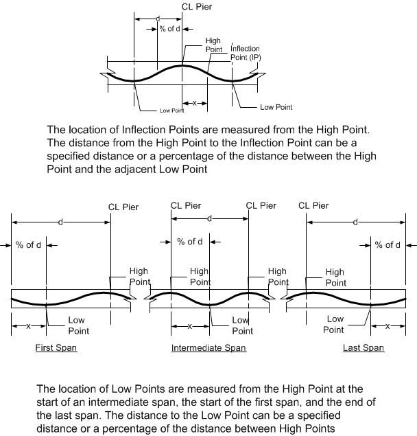

Parabolic Duct {#ug_dialogs_parabolic_duct}
==============================================
Define the geometry of the centerline of the duct with a sequence of parabolas defined by control points.

The parabolas connect to form a typical duct centerline for continuous girders. Low points of convex parabolas occur within spans and high points of concave parabolas occur over piers. The parameters are connect at inflection points.

The duct can start and end at any pier along the girder. Use the drop down lists above the grid to select the pier range for the duct. Fill in the grid with the horizontal location and top/bottom girder offsets of the duct control points.

*Duct control point grid*

Item | Description
-----|-----------
Point | Lists the control point of the parabola. Start is the start of the duct, Low is a low point within the span. IP indicates an inflection point. High is a high point at an interior pier. End is the end of the duct.
Location | Enter the horizontal location of the control point. Use the drop down list to select the unit of measure.
Offset | Enter the vertical offset of the control point. Use the drop down list to select the datum (top or bottom of girder).

The duct layout, relative to the precast segments, is displayed and updated as the duct control points are changed. The vertical drawing scale can be toggled with the schematic view button.

> NOTE: The duct layout in the last span is typically a mirror image of the first span. For this reason, the Low point in the last span is measured from the end of the span. If the low points of the duct in the first and last spans are 60% from the abutments, enter the low point as 60% for both spans instead of 60% in the first span and 40% (from the start end) of the last span.