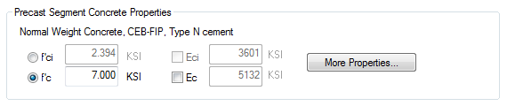
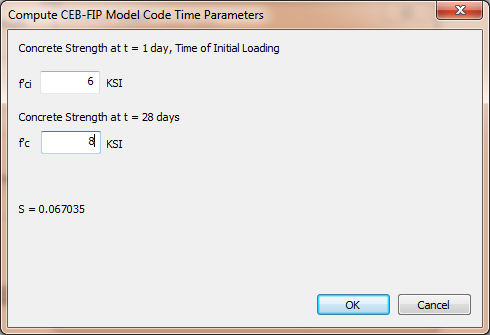

Defining Concrete {#ug_girder_modeling_defining_concrete}
==============================================
The concrete material models used in PGSplice are time-dependent. The concrete strength is taken to be a function of the age of the concrete.

> TIP: We define concrete age the time since the concrete was cast.

The specific time-dependent concrete models are discussed in @ref tg_time_dependent_material_models in the @ref technical_guide. Here we will discuss how to define the concrete model input parameters for a precast-segment.

> NOTE: The information present here is applicable to all concrete components in the bridge.

Here we see the concrete definition for a precast segment.

The time-dependent concrete model is defined by time variation parameters and a single concrete strength at a specified time. The time variation parameters depend on the specific time-dependent model we are using. We'll discuss this below.

The concrete strength parameter can be f'ci or f'c. Select the concrete strength type and enter the value. The age associated with f'ci is defined in the Construct Segments activity and the age associated with f'c is taken to be 28 days.

The time variation parameters can be modified by pressing [More Properties...]. In the Concrete Details window there will be a tab for the specific time-dependent concrete model. 

The figure above shows the parameters for the CEB-FIP model. You can select the concrete type and use the time variation parameters defined by CEB-FIP or you can enter your own parameters.

If you want to have f'ci and f'c be specific values, press [Compute Time Parameters...]. Enter f'ci and f'c and time variations parameters will be computed that fits the concrete strength curve through the points corresponding to the age and values for f'ci and f'c.

