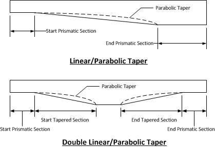

Defining a Girder {#ug_girder_modeling_defining_a_girder}
==============================================
The general layout of the spliced girders is defined in the bridge description. The location of the piers, temporary supports, and closure joints define the number and layout of the precast segments. The basic cross sectional dimensions of a girder are defined in the Girder library. The following information is needed to complete the girder definition:

* the exact girder type
* profile of the precast segments (constant depth, linearly tapering, parabolicly tapering, etc).
* prestressing configuration including number of strands, jacking forces, debonding, and strand extensions
* segment and closure joint concrete material properties
* actual arrangement of stirrups and longitudinal reinforcement in segments and closure joints
* vertical position of the segments in the final bridge structures with respect to the top bridge deck
* support points while the precast segments are in the casting bed, during lifting, during storage, and during transportation

This additional information is defined through the Girder Details window.

To define your girder:
1. Select *Edit > Girder...*. This will open the Girder Details window for the selected girder. If a girder is not selected, you will be asked to select a girder for editing.
2. Define the Segments and Closure Joints by pressing [Edit] in the Segments grid
3. Define the post tensioning in the Ducts/Tendons grid

Defining Segments
-------------------
Press [Edit], for a segment row, in the Segments grid to open the Segment Details window. 

To define your segment:
1. Define general information on the General tab including the shape of the segment. See discussion below.
2. Define the prestressing configuration on the Strands tab
3. Define the longitudinal reinforcement on the Long. Reinforcement tab
4. Define the stirrups on the Trans. Reinforcement tab
5. Define the temporary support conditions on the Temporary Conditions tab

### Defining the Segment Shape ###
The basic cross sectional shape of the segment is defined by its associated Girder library entry. The shape of the segment in elevation is defined in the Section Variations group on the General tab.

The Girder library entry defines if segments can vary in depth or if they must be constant depth. For variable depth girders, four variation types are available; Linear, Parabolic, Double Linear, and Double Parabolic. These variations are illustrated below.

The variation in segment depth is defined by the left of a prismatic (constant depth) section at the start and end of the segment. These sections are defined by their length and the overall segment depth. For Linear and Parabolic variations, the segment tapers in depth between the two prismatic sections. The parabola is always tangent to the bottom of the segment at the shallow end.

Double Linear and Double Parabolic variations are used to define haunched segments with two variations. In addition to the prismatic sections at the ends of the segment, the tapered sections are defined by their length and height. A linear taper in segment depth connects the ends of the start and end taper segments.

Some girder types support variable depth bottom flanges. This is common with I-Beam type sections. The bottom flange depth can be defined for the prismatic and tapered sections.

Some girder types support end blocks. End blocks are defined by their length, transition length, and width at the end of the girder. End blocks are a constant width for their length, and then transition back into the typical girder section over the transition length.

> TIP: The sketch of the segment updates as dimensions are changed. The dark gray segment is the current segment and the light gray segments are the adjacent segments. This image will show you how changes to this segment effects the adjacent segments. 

### Defining Segment Concrete Properties ###
Since PGSplice is using a non-linear time-step analysis, time-dependent material models are needed for concrete. The material model needs to define concrete strength and modulus of elasticity as a function of time. 

The general concrete material model is defined in the Project Criteria. The model is then customize for each piece of concrete in the bridge. To define the material model for a segment:

1. Enter either f'c or f'ci.
2. Press [More Properties...] to further refine the concrete model. Here you can define the concrete type such as Normal Weight or Lightweight, define the unit weight, and define the time variation parameters for the concrete model.

See @ref tg_concrete_models in the @ref technical_guide for more information about the time-dependent concrete material models.

Defining Closure Joints
-------------------------
Press [Edit], for a closure joint row, in the Segments grid to open the Closure Joint Details window. 

To define your closure joint:
1. Define general information on the General tab.
2. Define the longitudinal reinforcement on the Long. Reinforcement tab
3. Define the stirrups on the Trans. Reinforcement tab

Defining Ducts/Tendons
-----------------------
The post-tensioning ducts and tendons are defined in the Ducts/Tendons grid. Use [Add] and [Delete] to manage the ducts.

To define a duct and tendon:
1. Press [Add] to add a duct to the Ducts/Tendons grid.
2. Select the Duct Type. The available duct types are defined in the Duct library.
3. Enter the number of strands in the tendon
4. Select the live end for jacking and define the jacking force
5. Select the duct shape and press [Edit] to define its geometry. Ducts can be linear or parabolic.
6. Define the material, strand size, and strand installation method.

> TIP: The sketch of the girder shows the overall girder profile and the duct geoemtry. This example shows a 4 span girder made up of 7 variable depth segments with parabolic ducts. 

> NOTE: Ducts must run the full length of the girder. Partial length ducts are not supported at this time.
