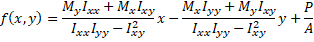

Biaxial Stresses {#tg_biaxial_stresses}
======================================
Biaxial stresses occur in precast-prestressed concrete girders due to:
1. Lateral loads
2. Asymmetry of the girder section

> NOTE: Biaxial stresses occur during lifting and hauling. These computation of these stresses are described in @ref tg_stability.

> NOTE: Biaxial stress conditions occur prior to the gidrer becoming connected to adjacent girders forming the bridge cross section. That is, once the girder is no longer an independent structural component, all stresses are computed assuming uniaxial bending.

Lateral Loads
--------------
When girders are installed with the top surface parallel to the roadway cross slope, lateral loads are induced. These loads, when combined with vertical loads, results in biaxial stresses.

The image below shows the vertical and lateral loads for a girder installed with a rotated orientation.

Asymmetric Girder Sections
---------------------------
Some girder sections, such as the decked bulb tee, are constructed with the top flange sloped to match roadway cross slope. This results in an asymmetric section. For this case, there are two sources of lateral bending.
1. Lateral bending due to asymmetry
2. Lateral bending due to lateral eccentricity of the precompression force.

The girder section shown below is asymmetric. The principle axes are not aligned with the vertical and horizontal axes and the product of inertia, Ixy, is non-zero. This results in a biaxial stresses on the girder section due to the vertical loads. Additionally, the centroid of the prestressing force (red/white target) is eccentric with respect to the center of mass of the section (blue/white target). This results in lateral bending due to prestressing as well as biaxial stresses due to the asymmetry of the section.

The figure below shows an arbitrary asymmetric section with moments Mx and My about the x and y axes.

The stress at any location in the section is computed by

