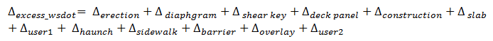

Camber {#tg_camber}
======================================
**Computed Camber**
Several elements make up camber computations. Each component is detailed in this section. Refer to Chapter 5 of the WSDOT Bridge Design Manual for a further discussion of camber, although most of the discussion is generic and can be used by any agency. The following schematic shows the camber history for a point in a girder with a cast in place deck and temporary strands.

Initial Camber
----------------
Initial camber occurs when the prestressing strands are released in the casting yard and the eccentric prestress force is imposed on the section. The beam has material properties associated with the release strength of the concrete and the span length is equal to the length of the girder. Immediately after release, the girders are removed from the casting bed and placed in storage. During storage the girder is supported at specified support locations. Typically these are the final bearing points but could be different. Thus, during storage, the span length is less than the span length at prestress release. The reduced span length during storage is taken this into account.

Erection Camber
---------------
The camber in the bare precast girder at erection after it is placed on the bearings and temporary strands are released, and just before the application of any additional gravity loads. It is assumed that all long-term losses have been applied at this stage.

Camber at Time of Deck Casting
------------------------------
The camber at time of deck casting is referred to as the "D" Camber on WSDOT plans.

Screed Camber 
---------------
Screed camber is equal to the amount the girder will deflect when the wet deck, traffic barriers, overlay, and other superimposed dead loads are placed. This is the amount the screeds must be cambered in order to achieve the correct finished roadway surface. The screed camber is refered to as "C" on WSDOT plans.

However, some agencies factor the components of deflection in order to generate results that better compare with empirical data. A generalized form of “C” camber is presented later in this document.

Excess Camber
===============================
Excess camber is the amount of camber (deflection) that remains in the girder after the diaphragms and deck are placed. Excess camber can also be defined as the amount of camber that remains at the initial time when the girder is put into service, not including effects of live loads. Excess camber can be computed as D - C.

**For WSDOT projects, and when using the Time-Step loss method**,  excess camber is computed by simply summing all computed girder deflections up until service: 

  

This equation, and the schematic at the top of this document, show the definition of  excess camber in a perfect world. However, in reality the components of deflection and losses needed to compute excess camber are practically impossible to compute accurately, so empirical methods are often used to estimate excess camber. Empirical methods typically apply factors to the individual camber components, so the concept of generalized excess camber will be presented in the next section. 

Generalized Excess and “C” Camber
----------------------------

As mentioned previously, many agencies including TxDOT, use empirical methods to compute excess camber. For example, TxDOT currently uses 80% of the deflection due to the slab weight, so for this case we can write:

  

Clearly, a more flexible method is useful to define excess camber, and cambers in general. A more general form is:

  

Using the same variables, the “C” (screed) camber can be redefined:

  

The k’s (or camber deflection multiplier constants) in the equations above provide flexibility so agencies can define camber as they see fit. For example: for WSDOT, all of the constants in the above equations are equal to 1.0. Multiplier methods for other agencies such as PCI can also be easily accomodated.

> TIP: Camber deflection multiplier constants are defined for each girder type on the Haunch and Camber tab in the girder library. Also, the Camber Details chapter in the Details report shows all details of the camber computations. Multipliers are not used for the time-step loss method.

Computed Camber vs Assumed Excess Camber
----------------------------------------
Camber discussed in this section of the Technical Guide is referred to as **Computed Camber** meaning that camber is calculated based on losses and deflections from load. In fact, the term **Computed Excess Camber** is used widely throughout PGSuper and PGSplice. Another term: **Assumed Excess Camber** is a user-input value that is optionally used in PGSuper to compute the haunch depth when determining haunch dead load, and non-prismatic composite section properties. Refer to  the Slab Haunch loading section of @ref tg_structural_analysis_models in the Technical Guide for more information about how the haunch dead load can be defined. Refer to @ref tg_section_properties in the Technical Guide for more information about how composite section properties are modelled.

> NOTE: Assumed excess camber input is only applicable when haunch depths are defined using Slab Offset input. 

Camber Variability
----------------------
Camber is notoriously difficult to predict, so a practical approach is to use a statistical range to bound upper and lower values as recommended in Reference 1 (cited below). In PGSuper, we make two camber predictions: one for a normal (maximum timing) construction scenario, and another for a fast (minimum timing) construction scenario. However, for each case there is variability in camber due to a number of concerns, including curing time (girders cured over a weekend camber less then those with a 24 hour turn around). This natural variation in camber is accommodated by predicting a lower bound value. In most cases the actual camber will be somewhere between the predicted upper and lower bounds. 

To determine the lower bound camber, a Camber Variability (Cv) factor is applied to the upper bound camber. Cv is entered as a percentage reduction of the upper bound camber.

> NOTE: A warning will be issued if the computed excess camber is less than, or within 0.25" if greater than, the screed camber to alert you that the girder has the potential to sag if actual excess camber is less than the computed value. Note that this is not an absolute predication that sag will occur: It's just a warning that a worst case scenario may end up with sag, and engineers should take steps to mitigate problems. The slab haunch loading does not account for sag in the girder.

The lower bound camber is an attempt to reflect natural variations in camber. When WSDOT reviewed camber data, they found most all measured cambers were enveloped between the upper bound value and 50% of the upper bound camber. This is consistent with the findings in Reference 1, and use of the 50% value is WSDOT's standard practice.

WSDOT does not allow contractors to cast the deck prior to the minimum timing and takes extra measures to control unrestrained camber if deck casting occurs after the maximum timing. (i.e. they have to cast the deck between 40 and 120 days). WSDOT reports to contractors, cambers at time of deck casting as Upper Bound D120 and Lower Bound D40, for deck casting at 120 days and 40 days. This envelopes the full range of cambers contractors can expect and provides guidance when bidding the amount of haunch concrete to be placed.

> TIP: Camber range values are reported in the Camber table near the end of the Spec Check report.

References
-----------
1. [A Probabilistic Comparison of Prestress Loss Methods in Prestressed Concrete Beams, PCI Journal, September-October, 2004, Volume: 49, Issue: 5 Page number: 52-69 Author(s): Christopher G. Gilbertson, Theresa M. (Tess) Ahlborn] (https://www.pci.org/PCI/Publications/PCI_Journal/Issues/2004/September-October/A_Probabilistic_Comparison_of_Prestress_Loss_Methods_in_Prestressed_Concrete_Beams.aspx)

