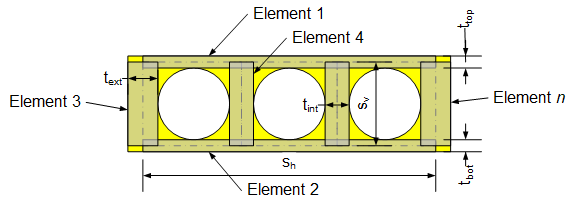
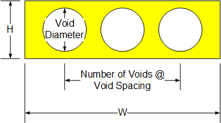
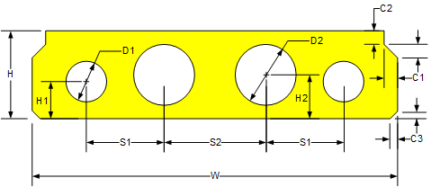

St. Venant Torsion Constant for type f and g sections {#tg_torsion_constant}
======================================
This section describes how the St. Venant torsion constant, J, is computed for type f and g sections from LRFD Table 4.6.2.2.1-1.

Type f and g sections are considered to be closed thin-walled shapes. The St. Venant torsion constant is given by LRFD Equation C4.6.2.2.1-3,

\f[
     J = \frac{4 {A_o}^2}{\sum{\frac{s}{t}}}
\f]

The beam section is discritized as shown in the image below:

## Basic Voided Slab
The dimensions for a basic voided slab torsion constant are:

| Element | s | t |
|---------|---|---|
| 1 Top | W - t_ext | (H - Void Diameter)/2 + Structural Slab Depth |
| 2 Bottom | W - t_ext | (H - Void Diameter)/2
| 3 Exterior | H + Structural Slab Depth - t_top/2 - t_bot/2 | [W - (# of voids - 1)(void spacing) + (void diameter)] / 2
| 4 Interior | H + Structural Slab Depth - t_top/2 - t_bot/2 | (void spacing) - (void diameter)

## Advanced Voided Slab
The dimensions for an advanced voided slab torsion constant are:

| Element | s | t |
|---------|---|---|
| 1 Top | W - 2*Max(c1,c3) - t_ext | Min of (H - H1 - D1/2) and (H - H2 - D2/2) + Structural Slab Depth |
| 2 Bottom | W - 2*Max(c1,c3) - t_ext | Min of (H1 - D1/2) and (H2 - D2/2) |
| 3 Exterior | H + Structural Slab Depth - t_top/2 - t_bot/2 | W - 2*Max(c1,c3) - (2*S1 - (number of voids - 3)S2) - D1/2 |
| 4 Interior between Exterior and Interior Void | H + Structural Slab Depth - t_top/2 - t_bot/2 | S1 - D1/2 - D2/2 |
| 5 Interior | H + Structural Slab Depth - t_top/2 - t_bot/2 | S2 - D2 |

For exterior beams, c1 is taken to be zero on the exterior face.
