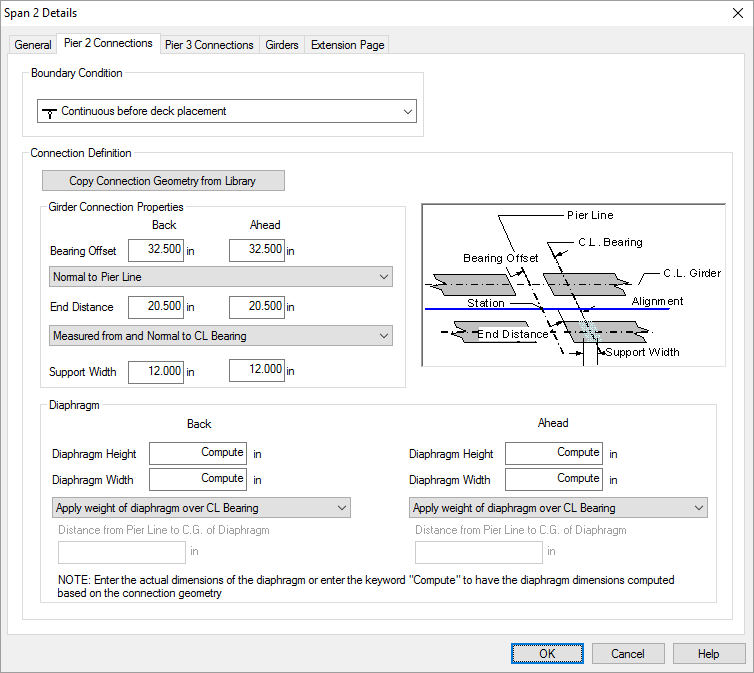
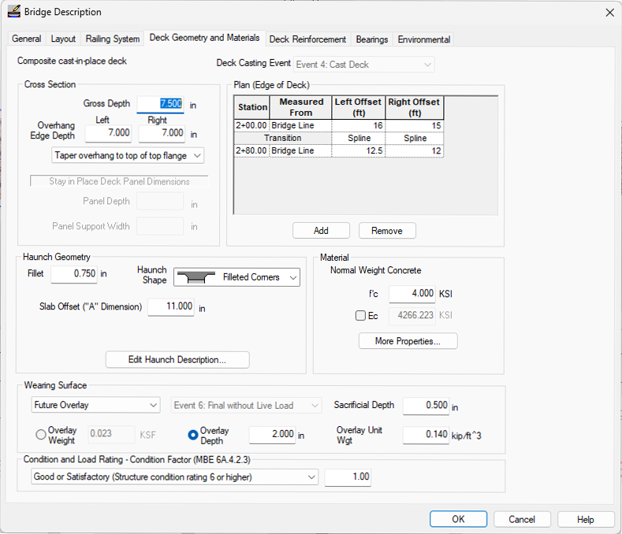

Example Bridge 1 {#tutorial_advanced_example_1}
==============================
New PGSuper projects are created from project templates. The templates contain standard configurations for bridge geometry and components, appurtenances, loading, and design criteria. Since Example Bridge 1 is a WSDOT WF58G girder bridge, the easiest way to start is with the WF58G template.

> TIP: You can customize project templates and their organization. See @ref ug_configurations in the @ref user_guide for more information.

Start PGSuper
--------------
To start PGSuper, select *Start > Programs > Engineering Applications > PGSuper*.

Create a New Project
--------------------
1. Select *File > New*. This brings up the New Project window.
2. Select the WF-Girders Project Type and the WF58G template. 
3. Press [OK].
4. If the Project Properties dialog is displayed, you may enter some information about this project.

The bridge modeled in the default WF58G template isn't exactly what we need. In the next few sections you will learn how to locate the bridge piers and establish the framing plan for the bridge girders.

We define the bridge beginning with the roadway alignment. Since the alignment is curved, it has a significant impact on the bridge geometry. For example, each girder in a span will be a different length because of the curvature effect.

Defining the Alignment
-----------------------
1) Select *Edit > Alignment...*. This will bring up the Alignment Description window. Describe the horizontal curve by inputting the curve definition shown below. 

Defining the Bridge
--------------------
1) Select *Edit > Bridge...*. This will bring up the Bridge Description window.

Our bridge does not have the same number of girder lines in all spans, nor is the same girder spacing used in all spans. On the General tab, remove the check for the number of girder and girder spacing options. This will allow us to define the number of girders and girder spacing span by span.

When you remove the check marks you will be presented with a Hint that explains how to define the number of girders and girder spacing span by span.

> NOTE: If you disable Hints by checking the "Don't show this hint again" box, you can enable all hints selected *Options > Hints...*

2) Select the Layout tab and define all three spans.

3) Frame girders in Span 1. On the Span 1 line in the grid, press [Edit]

Select the Girders tab, input 5 girder lines and enter the girder spacing. 

> NOTE: You can select four different methods of defining the girder spacing. Girder spacing can be measured at the centerline of pier/abutment or at the centerline of bearing. The girder spacing can be measured along the centerline of the pier/abutment/bearing or normal the alignment

> NOTE: Different spacing can be used between the various girders in the cross section. For this example, select the girder spacing column titled A-E (ft), right click on it and select Expand from the menu. This will expand the input so you can enter spacings between girders A and B, B and C, C and D, and D and E. Adjacent columns can be selected, and the Join command can be used to group the together, allowing input of a group of girders. This will be highlighted in the Example Bridge 2 portion of this tutorial.

4) Frame the girders in Span 2. In the Framing grid, press [Edit] for Span 2.

Select the Pier 2 Connections tab. There is where we can set the connection geometry and boundary conditions at Pier 2. 

Input the connection geometry and boundary conditions as shown

Repeat for the Pier 3 Connections tab using the same data.

Select the Girders tab. Set the number of girder lines to 4. Set the spacing at the start of the span (Ahead side of Pier 2) to be 8 ft and at the end of the span (Back side of Pier 3) to be 6 ft.

5) Frame the girders in Span 3. In the Framing grid, press [Edit] for Span 3.

Select the Connections tab and note that the connection geometry and boundary condition on the Ahead side of Pier 3 matches the value we input in the previous step.

Select the Girders tab and input 4 girder lines at 6 ft spacing

6) Select the Deck Geometry and Materials tab.

Press [Add] to add a deck edge point in the Edge of Deck grid. Input the edge of deck as shown.

Press [OK] to apply all these changes to the bridge model. The resulting model is shown in the Bridge Model View

Now let's move onto [Example Bridge 2](@ref tutorial_advanced_example_2).

