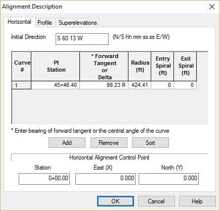
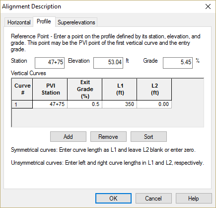
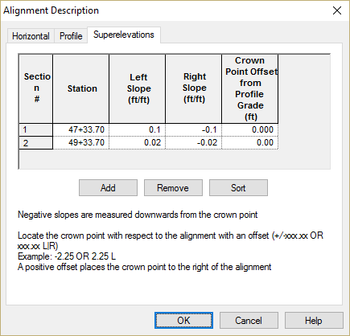
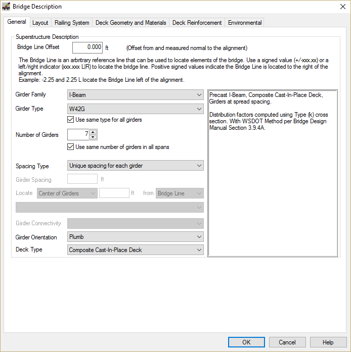
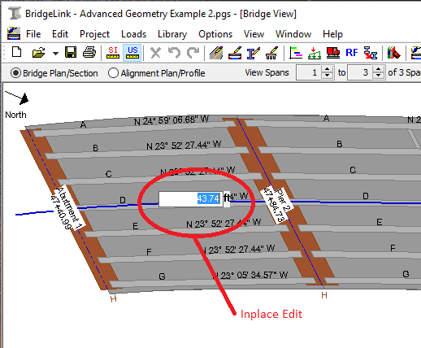
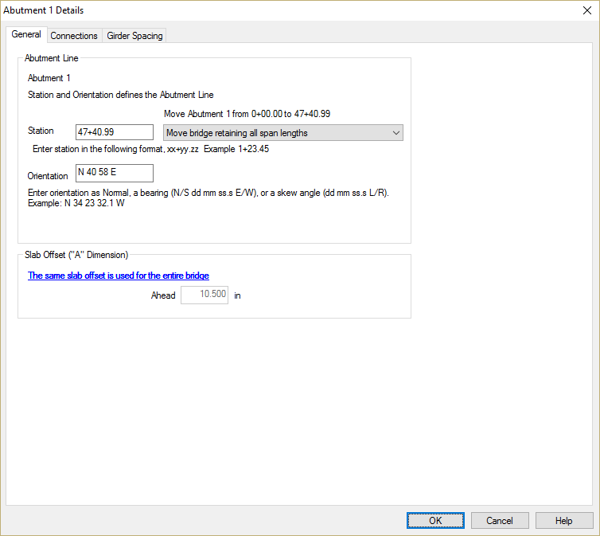
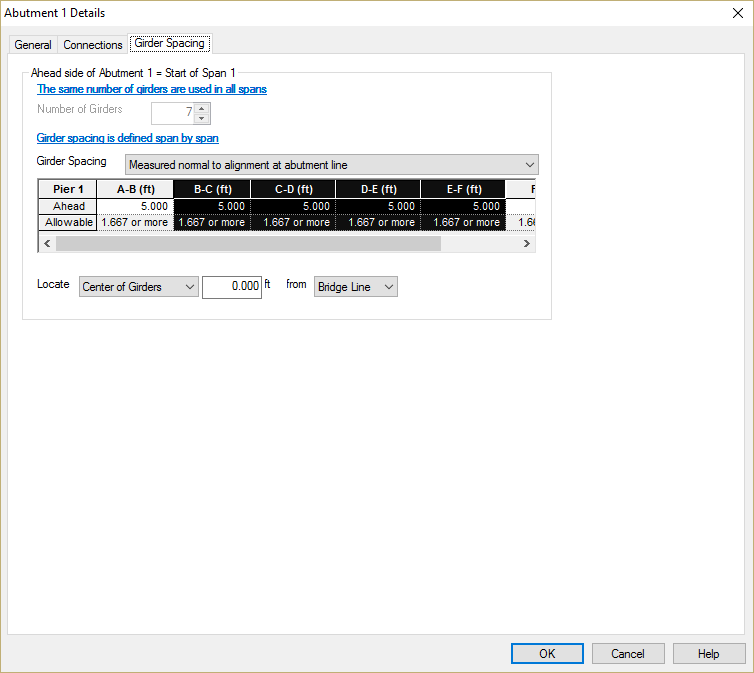
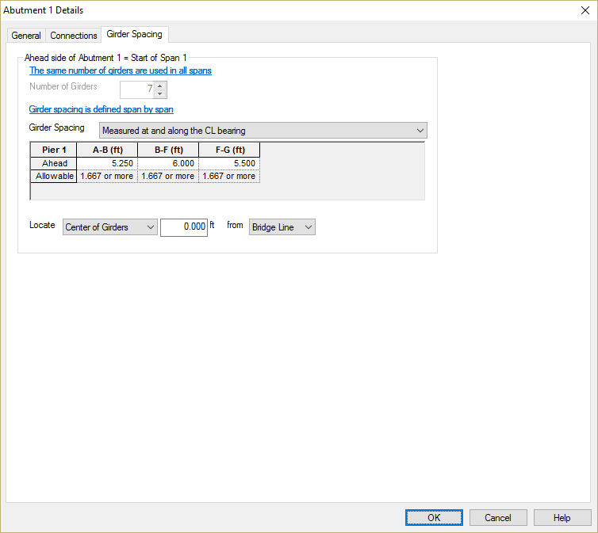
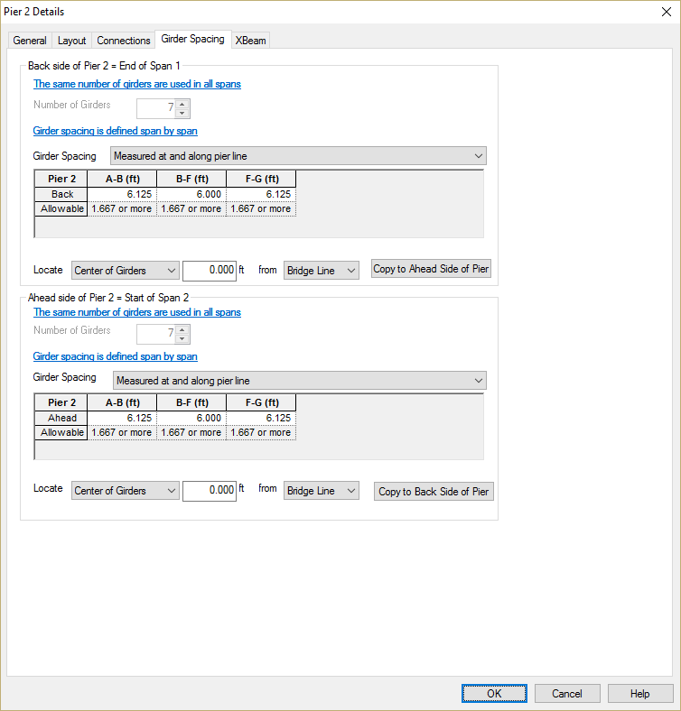
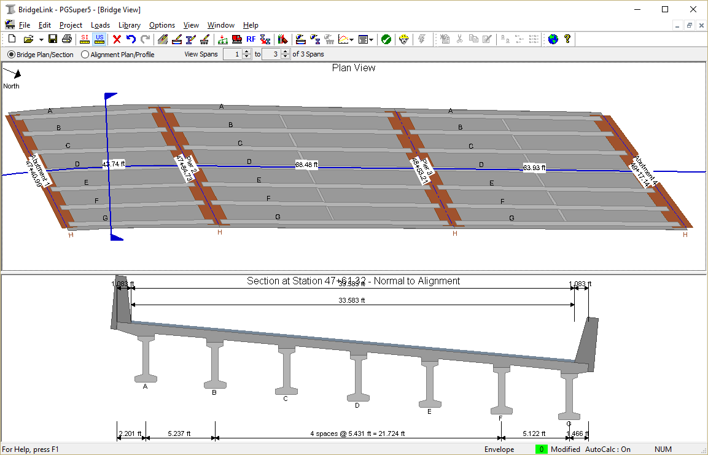

Example Bridge 2 {#tutorial_advanced_example_2}
==============================
Creating the Project
--------------------
Create a new PGSuper project file based on the W42G template. The steps are the same as for Example Bridge 1.

Editing the Bridge Model
-------------------------
We will be using different editing techniques to create this bridge model. The techniques you've seen in previous examples will work just fine, we simply want to show you some of the other editing features of the software.

Let's start by editing the alignment.

1) Select *Edit > Alignment...*

Input the alignment, profile, and superelevations as shown

2) General Bridge Settings

We need to set the general bridge information. Specifically, this bridge uses a different girder spacing in each span. A quick way to get at the Bridge Description information is to double click the left mouse button while the mouse pointer is over the whitespace Bridge Model View.

Set the number of girders to 7 and remove the check mark for girder spacing in all spans

3) Add spans

This is a three span bridge, so we need to add two more spans. We could use the framing grid on the Framing tab, but we've done that before. Let's learn a new technique.

Right click the mouse on Abutment 2 in the Bridge Model View. Select Insert from the pop-up menu. An Insert Span dialog is presented. Press [OK] to create a span.

Repeat this process to create the third span

4) Define Span Lengths

We are going to input the span lengths using a feature known as In-place Editing. Left button click the mouse on the length of Span 1 in the Bridge View. An edit box should appear. Input the span length of 43.74ft

Repeat this process for Spans 2 and 3. The span lengths are 68.48 ft and 63.93 ft respectively.

5) Position the Bridge along the alignment

The spans have the correct length along the alignment, however the bridge is in the wrong position. We can move the entire bridge by setting the location of one of the piers. Double-click on Abutment 1 to bring up the Abutment Details window. 

Enter the station of Abutment 1. Since we want to move the bridge, select the Move bridge retaining all span lengths option.

> TIP: The length of adjacent spans can be changed by moving a pier.

Since we are editing the details of Abutment 1, we may as well set the pier orientation.

Before closing this window, let's set the girder spacing at Abutment 1. Select the Girder Spacing tab.

Set the girder spacing to Measure at and along the centerline bearing.

Place the mouse arrow over the column of the spacing grid labeled A-G (ft). The cursor will change to a black down arrow.

Right click on the gird and select Expand. This will expand the grid, allowing for spacing input between every girder.

Using the left mouse button, click on the column labeled B-C (ft) and drag the mouse to the column labeled E-F (ft). This will select four columns as shown.

Right click on the selected group of columns and select Join. This will join the four columns into one labeled B-F (ft). Enter the girder spacing.

Repeat this process for Pier 2, 3, and Abutment 4. Note that girder spacing is measured differently at the interior piers.

The spacing on both sides of the interior piers is the same. To simplify input, define the spacing on the back side of the pier and press [Copy to Ahead Side of Pier].

Press [OK] to apply all these changes to the bridge model. The resulting model is shown in the Bridge Model View

