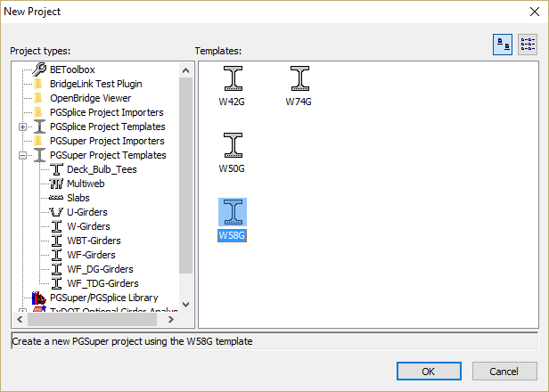
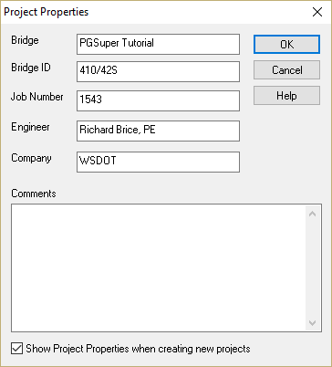
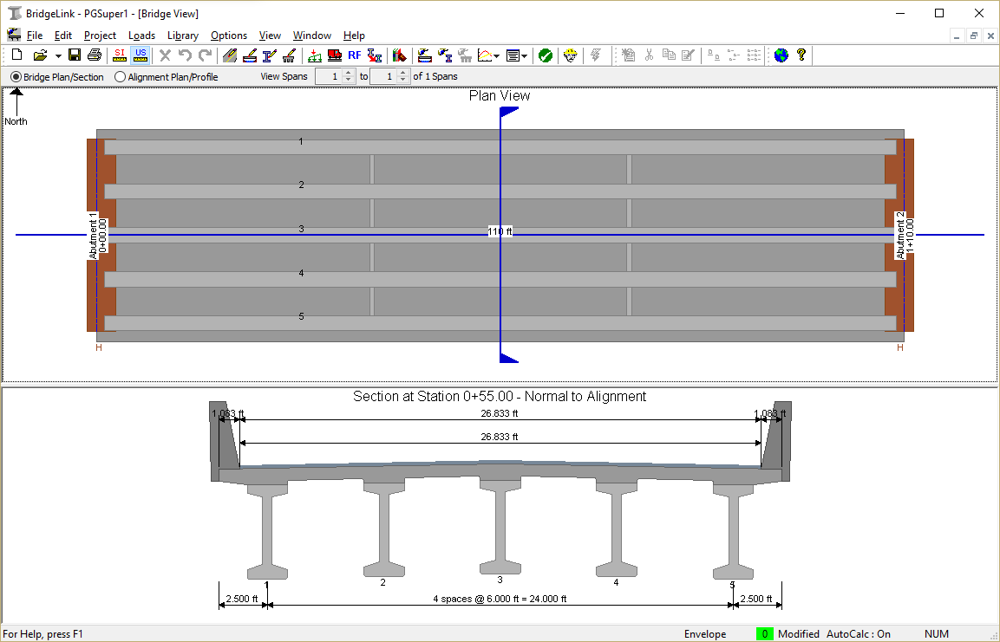

Create a PGSuper Project {#tutorial_general_new_project}
==============================
New PGSuper projects are created from project templates. The templates contain standard configurations for bridge geometry and components, appurtenances, loading, and design criteria. Since this is a WSDOT W58G girder bridge, the easiest way to start is with the W58G template.

> TIP: You can create your own project templates and customize their organization. See @ref ug_configurations in the @ref user_guide for more information.

Start BridgeLink
--------------
To start the BridgeLink application framework, select *Start > Programs > Engineering Applications > BridgeLink*.

Create a New Project
---------------------
1. Select *File > New*. This brings up the New Project window. 
2. Select PGSuper Project Templates and then W-Girders from the Project types list.
3. Select W58G from the template list. Press [OK].
4. This will create a new project and bring up the Project Properties dialog where you can enter information about your project. 

> NOTE: The Project Properties dialog may not open when creating a new project. If this is the case, select *File > Project Properties* or *Project > Properties*. Use the check box at the bottom of the dialog to control whether the dialog opens when new projects are created.

Finally the default configuration for this type of bridge will be displayed in the Bridge Model View.

