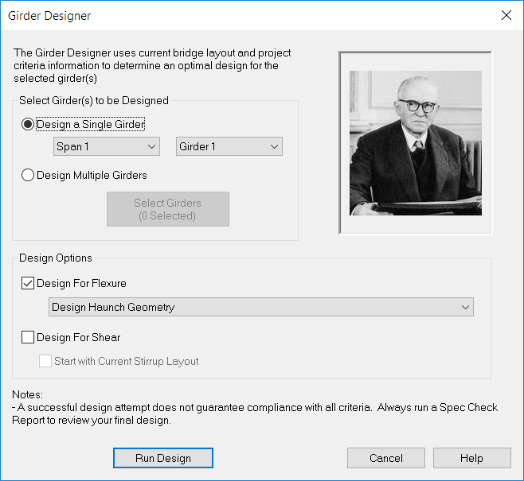

Designing Girders {#tutorial_general_design_a_girder}
==============================
At this stage of the project there are several unknown girder parameters, such as number of prestressing strands and concrete strength. It is your job to figure them out and PGSuper will help you. You need to determine the number of strands, strand configuration, release strength of the girder concrete, and the 28-day strength of the girder concrete. You will also need to determine the location of lifting devices and support location for transportation to ensure the girder is not overstressed and is stable during handling and transportation. PGSuper has a design feature that will determine these parameters. In this section of the tutorial, you will learn how to design a girder using PGSuper's automated design feature.

Designing a Girder
-----------------------
1. Select *Project > Design Girder*. This brings up the Girder Designer window. 
2. We will design the first exterior girder. Select Span 1 and Girder A.
3. WSDOT girders have standard stirrup configurations. We don't want the PGSuper Designer to attempt to re-design these standard details. Check only the Design For Flexure box so the PGSuper Designer attempts to design only for flexure. We want PGSuper to determine the required slab offset ("A" Dimension).
4. Press the [Run Design] button to start the design.
5. When the Girder Designer finishes the Design Outcome is displayed. The design outcome shows the design proposed by PGSuper and the current girder configuration. As you can see, PGSuper found a design that works. 
6. At this point you have the option of accepting or rejecting PGSuper's design. Accepting the design updates the current bridge data with the design data. If the design is rejected, none of the data is altered. Press [Accept the Design].

> TIP: You can quickly design a girder by right clicking on it in the Bridge Model View and selected Design Girder from the context menu

Specification Check Report
---------------------------
The Girder Designer considers only a subset of the criteria that typically controls a design. You should always consider the design as a starting point rather than a final solution. The next step is to perform a full specification check on the girder. To do this, you will create a Specification Check Report.

### Creating a Report ###
Reports are created by selecting a report from the list of available reports. We want the Spec Check Report.
1. Select *View > Reports > Spec Check Report*. This brings up the Report Options window for the Spec Check Report. 
2. Select Span 1 and Girder A (This is the girder you designed). Also select the chapters to be reported. 
4. Press [OK] to generate the report.

> TIP: You can quickly create a report by right clicking on the desired girder in the Bridge Model View and selecting the report title from the context menu

After reviewing the report, you will find that PGSuper made a pretty good guess. Since all the other girders are the same, let's copy the parameters from Girder A to all the other girders.

Select *Project > Copy Girder Properties...* This will bring up the Copy Girder Properties window. Select Span 1 Girder A from the left hand column. This is the girder you will be copying from. Select Span 1 All Girders in the right hand column. The properties from Girder A will be copied to these girders. We want to copy all the properties so make sure all the boxes are checked. Press [Copy Now] to copy the properties. 

> TIP: Always view report results for all unique girders in the bridge. You should always review at least one exterior and one interior girder.

> TIP: See @ref ug_design in the @ref user_guide for information on PGSuper's Automated design capabilities.

> TIP: See @ref ug_girder_modeling in the @ref user_guide for information on girder editing.

