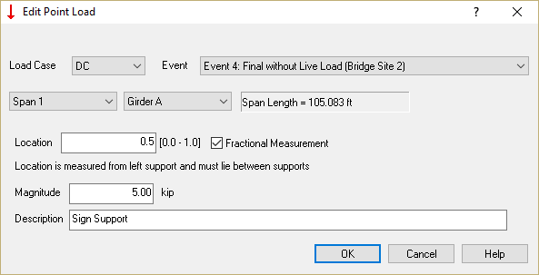
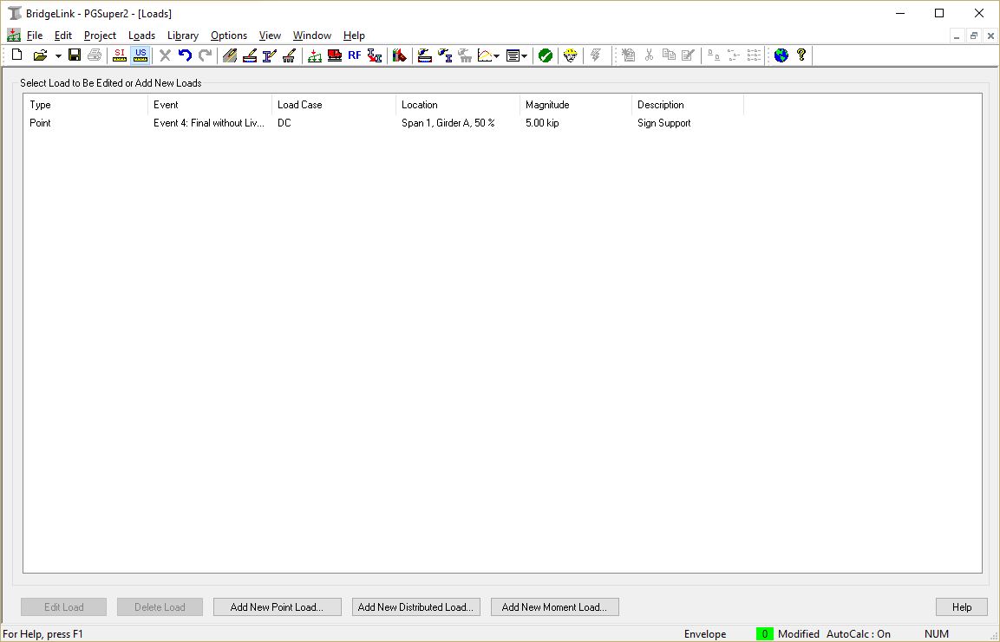
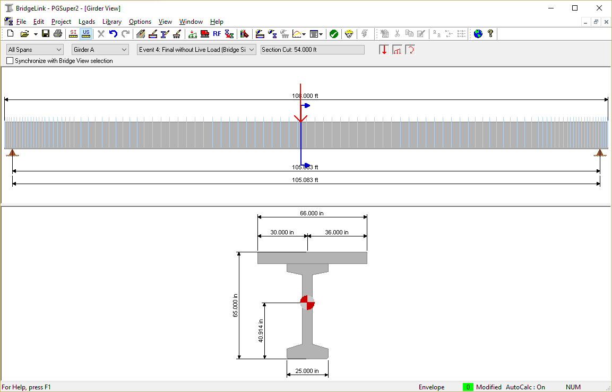

Modeling a Special Dead Load {#tutorial_modeling_a_special_dead_load}
==============================
A 10 kip overhead sign structure is placed at mid-span (station 2+33.66). The entire sign weight is assumed to be split evenly between the exterior girders on either side of the bridge. Hence we need to apply a 5 kip load at the mid-span of girder A. The load will be applied to the bridge after the deck and railing system have been constructed.

1. Select *Loads > Add Point Load...*
2. Enter the loading information 

User defined load information can be seen Loads View and the Girder View.

The Loads View provides a tabulated listing of all the user defined loads. You can sort, add, edit, and delete loads from the Loads View. Select *Loads > Edit User Defined Loads* to open the Loads View.

The Girder View provides a graphical representation of user defined loads applied to a particular girder. Loads can be added, edited, and deleted from the Girder View. Select *View > Girder* to open the Girder View.

Our bridge description is now complete. Our next step is to design the girders.

