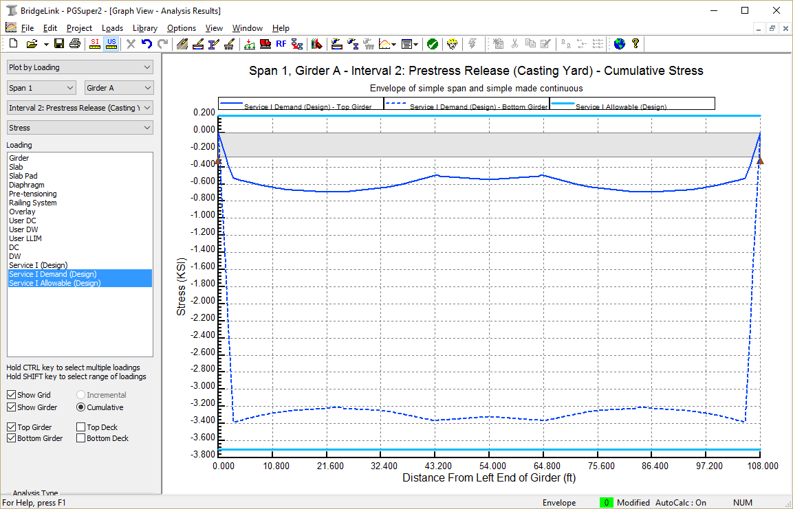

Reviewing Results {#tutorial_general_reviewing_results}
==============================
PGSuper has two robust facilities for reviewing results. Analysis results can be viewed graphically or in a report format. You've already had a peek at the reporting features of PGSuper. Let's continue exploring the reporting features by looking at analysis results for the first interior girder.

In the last section of the tutorial you copied the properties of Girder A to all the remaining girders in the structure. In this section you will create a Details Report for Span 1, Girder B. The Details Report provides the details of the calculations performed by PGSuper so you can verify results and be confident in using them in your designs. 

Creating the Details Report
------------------------------
1. Select *View > Reports > Details Report*. This displays the Report Options window.
2. Select Span 1 and Girder B.
3. Press [OK] and he report will be automatically generated.

Reviewing the Details Report
----------------------------
The Details Report gives extensive details about the bridge and the analysis that was performed. The Details Report should serve as the record of the work that PGSuper has done on your behalf. This report not only contains summary results of the various specification checks, it also contains all input data and details for the intermediate calculations.

> TIP: The Table of Contents feature makes it easier to navigate reports. To view the Table of Contents, click the right mouse button over the report and select Table of Contents.

> TIP: You can search the report for keywords. To search the report, click the right mouse button over the report window and select the Find option. In the Find dialog, enter the search keyword or phrase.

Graphical Results
------------------
You can view a wide variety of graphical results. The most common results of interest are moments, shears, deflections, and stresses. You can also see graphical representations of girder properties, effective prestress, and more.

### Viewing Graphical Results ###
1. Begin by opening the Analysis Results window. Select *View > Graphs > Analysis Results*. 
2. Use the controls along the left side of the Analysis Results window to select the various graphs that are available. Note that these graphs call also be printed. Go ahead and select some graphics now.

