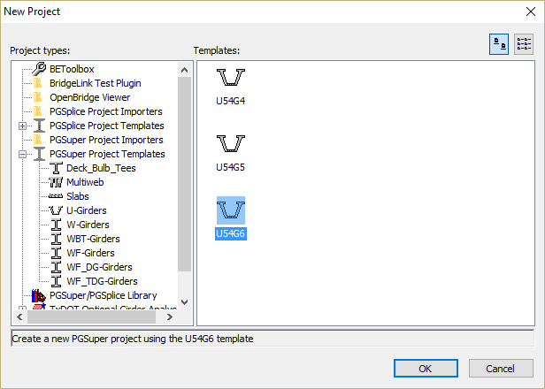
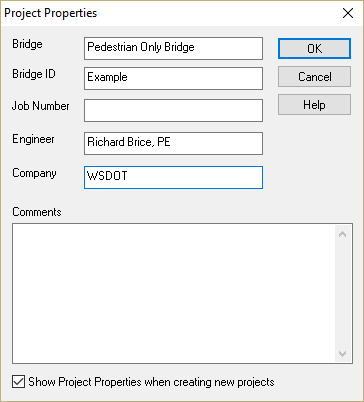
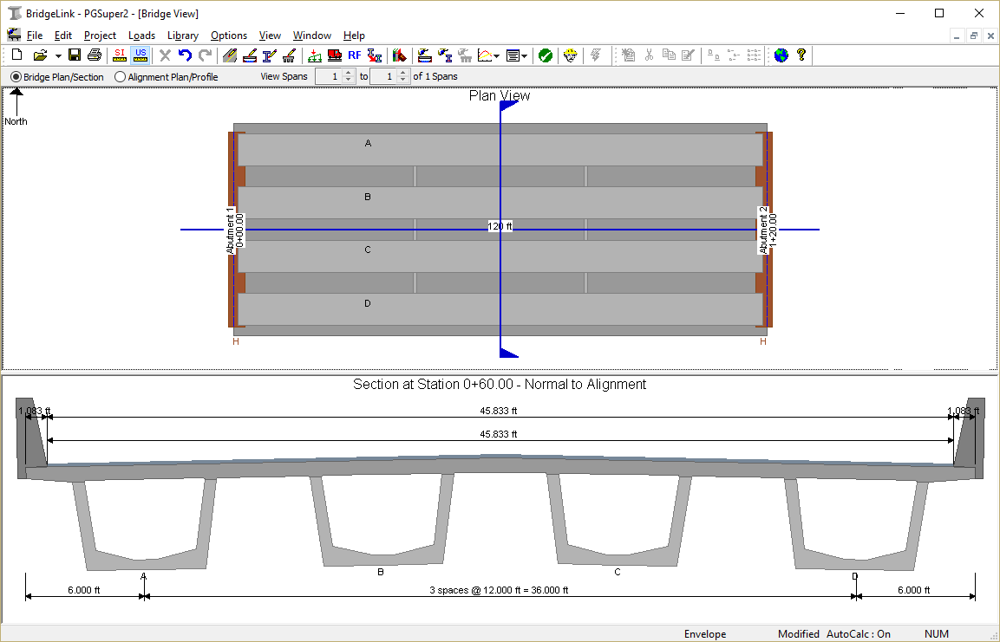

Create a PGSuper Project {#tutorial_pedestrian_creating_a_project}
============
New PGSuper projects are created from project templates. The templates contain standard configurations for bridge geometry and components, appurtenances, loading, and design criteria. Since this is a WSDOT U54G6 girder bridge, the easiest way to start is with the U54G6 template.

> TIP: You can customize project templates and their organization. See @ref ug_configurations in the @ref user_guide of the User Guide for more information.

Start PGSuper
-------------
To start PGSuper, select *Start > Programs > Engineering Applications > PGSuper*.

### Create a New Project ###
1. Select *File > New*. This brings up the New Project window. 
2. Select the U-Girders Project Type and the U54G5 template. Press [OK].
3. This will bring up the Project Properties window where you can enter information about your project. 

> NOTE: The Project Properties window may not open when creating a new project. If this is the case, select *File > Project Properties* or *Project > Properties*. Use the check box at the bottom of the window to control whether the window opens when new projects are created.

Finally the default configuration for this type of bridge is displayed in the Bridge Model View.

