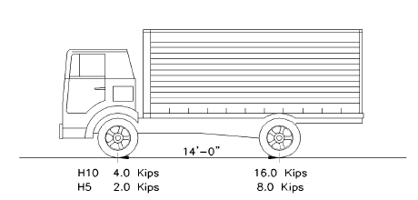
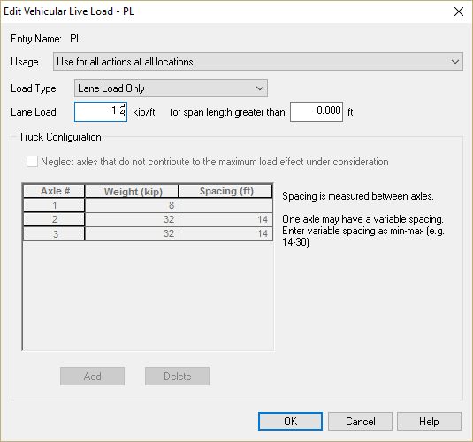
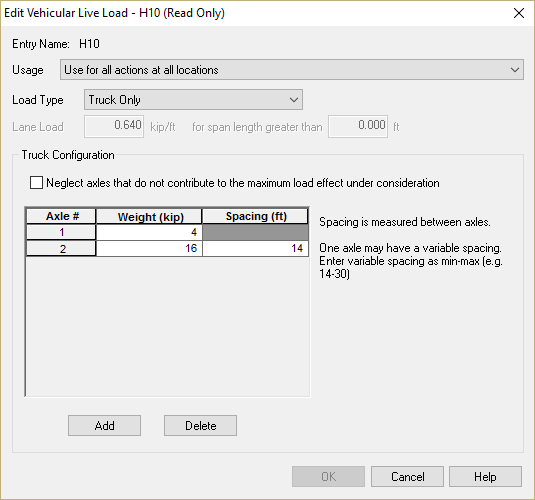
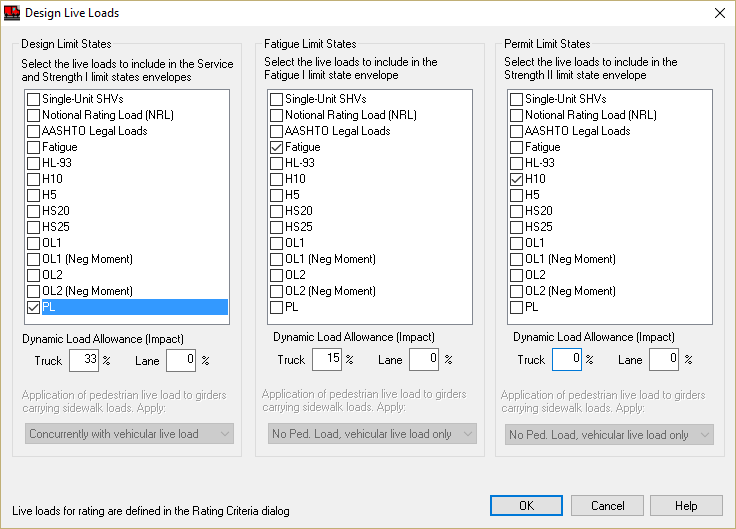
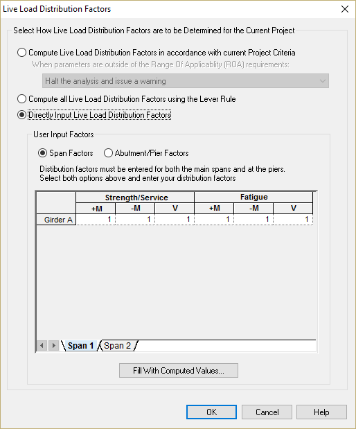

Defining the Loading {#tutorial_pedestrian_defining_the_loading}
============
The loading for a pedestrian/bicycle only bridge is a bit different than that for a standard vehicular bridge. AASHTO LRFD Article 3.6.1.6 describes the required loading. Note that in the 2008 interim provisions, AASHTO added a requirement to include a maintenance vehicle in the design.

Loading Requirements
-------------------
The bridge must be design for a pedestrian live load of 0.085 ksf. For our structure, the curb-to-curb width is 14'-3" so the loading will be 1.211 k/ft. 

For bridges with a clear width 10 ft or greater the bridge must also be designed for an H10 vehicle in the Strength II Limit State.

Defining the Pedestrian Live Load
------------------------------------
We have two options for defining the pedestrian live load because it is a uniform load over the entire length of the bridge. The first option is to create a "static" live load by applying a uniform load directly to the girder and telling PGSuper it is a live load. However, this is a "static" load and will be applied over the entire length of the bridge at all times. A better option is to create a "vehicular live load" that consists of only a lane load. Vehicular live loads are pattern loaded on the structure so the maximum force effects can be determined.

To create the pedestrian live load, select *Library > Edit Libraries*. This will open the Library Editor window.

Select the Vehicular Live Load library on the left hand side of the window. Now select *Library > Add New Entry*. This will create a new entry in the library. 

Right click on the new entry, select Rename, and rename it PL.

Double click on this library entry to bring up its editing dialog. Enter the information shown here.

Defining the H10 Live Load
--------------------------
Repeat this procedure described for the pedestrian live load, except name the library entry H10 and use the parameters shown below.

Applying the Loads to the Bridge Model
--------------------------------------
Now that the loads are defined, they must be applied to the bridge model. Select *Loads > Live Loads* to bring up the Design Live Load window. In the Design Limit States list, select the PL load and make the Lane impact 0%. In the Permit Limit States list, select the H10 load and make the Truck impact 0%.

Live Load Distribution Factors
------------------------------
This particular bridge configuration violates the minimum number of girders required for simplified analysis (See AASHTO LRFD 4.6.2.2). However, since we have a single girder line and only one design lane it is obvious that the distribution factors should be 1.0. We will need to explicitly input the distribution factors.

1. Select *Loads > Live Load Distribution Factors *
2. Select Directly Input Live Load Distribution Factors and enter 1 in all the spaces for both Span 1 and Span 2

We are now ready to design and analyze this bridge.

