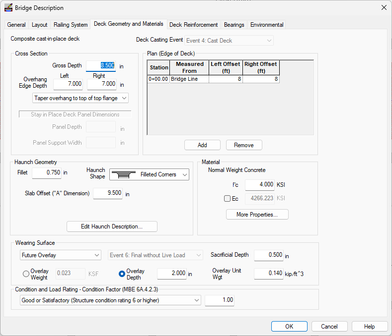

Editing the Bridge Model {#tutorial_pedestrian_editing_the_bridge_model}
============
The bridge modeled in the default U54G6 template isn't exactly what we need. In the next few sections you will learn how to locate the bridge piers and establish the framing plan for the bridge girders.

We define the bridge beginning with the piers. The piers are where the bridge geometry intersects the roadway geometry (for this example, we'll just go with the default roadway). The locations of the piers establish the location of the bridge along the alignment.

Defining the Bridge
---------------------
1. Select *Edit > Bridge...*. This will bring up the Bridge Description window. On the General tab, set the number of girder lines to 1. 
2. Select the Layout. This is where we will layout the abutments and piers. 
3. Press [Insert Span] to create a new span.
4. Accept the default span values and Press [OK]
5. We could edit the stations of each pier, but it is sometimes easier to hold a pier at a given station and layout the rest of them by span length. Press [Layout by Span Lengths...] and enter the information shown. 
6. Press [OK]. The pier stations in the layout grid will be adjusted for these span lengths.
7. This bridge is continuous at Pier 2 so we need to edit the boundary conditions. To make the connection at Pier 2 continuous after deck placement, press [Edit] in the Pier 2 row of the grid. This opens the Pier 2 Details window. 
8. Select the Connections tab and change the boundary condition to "Continuous after deck placement". 
9. Press [OK] to set the boundary condition and return to the Bridge Description layout.
10. Select the Deck Geometry and Materials tab to define the deck geometry. Enter the information shown below. 
11. Press [OK]. The Bridge Model View is updated to reflect the current project data. 

> NOTE: The connection geometry describes the location of the point of bearing relative to an arbitrary reference line and the location of the end of the girder relative to the point of bearing. Predefined connections are stored in the Connections Library. See @ref ug_design in the @ref user_guide for more information.
