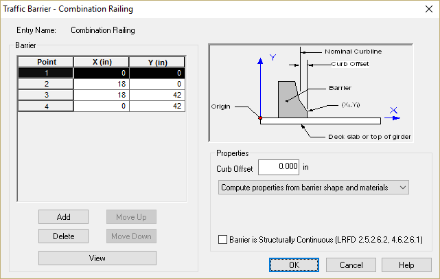

Define the Combination Railing {#tutorial_sidewalks_define_the_combination_railing}
============
Before we describe the bridge, we need to first create the combination railing that separates the vehicular lanes from the sidewalk. We will create this barrier in the Traffic Barriers library.

Begin by selecting *Library > Edit Libraries* to open the Library Editor. Select the Traffic Barriers library.

Select *Library > Add New Entry* to create a new library entry. The new entry will be created in rename mode. Type "Combination Railing" for the name.

Double click on the "Combination Railing" library entry to open the editing window. Railings are described by coordinates at the vertices of the barrier shape. For interior barriers, the origin of the coordinate system is somewhat irrelevant. The barrier will be placed such that it is adjacent to the sidewalk. 

Barriers are described assuming they are on the left hand side of the structure. PGSuper will use a mirror image of the barrier system if it is on the right hand side of the structure. Barriers and sidewalks will be rotated to match the slope of the deck.

Enter the data shown to describe the combination railing system.

The shape of the combination railing can be visually validated by pressing [View].

