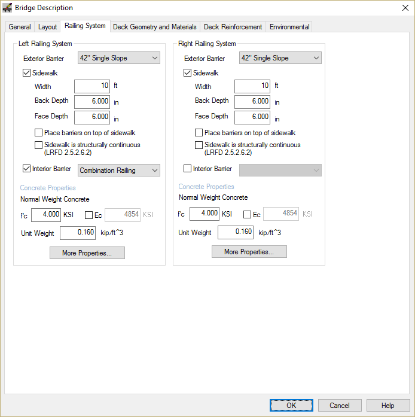
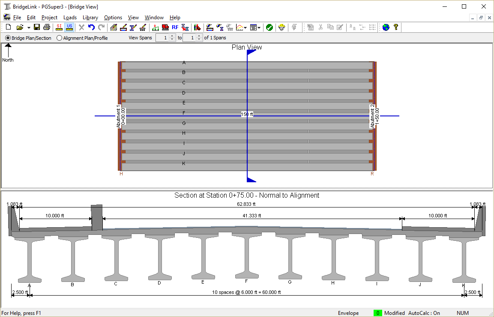

Editing the Bridge Model {#tutorial_sidewalks_editing_the_bridge_model}
============
The bridge modeled in the default WF74G template isn't exactly what we need. In the next few sections you will learn how to locate the bridge piers and establish the framing plan for the bridge girders.

We define the bridge beginning with the piers. The piers are where the bridge geometry intersects the roadway geometry (for this example, we'll just go with the default roadway). The locations of the piers establish the location of the bridge along the alignment.

Defining the Bridge
---------------------
The General Features and Pedestrian Only Bridge tutorials explain step-by-step how to define the basic bridge configuration. These steps won't be repeated here. We will focus only on the bridge railing systems and sidewalks.

1. Select *Edit > Bridge...* to open the Bridge Description window.
2. Set the number of girders to 11 on the General tab
3. Set the slab overhangs to 32.5' on the Deck Geometry and Materials tab
4. Select the Railing System tab (completed input is shown below)
5. Select the 42" Single Slope barrier as the exterior barrier
6. Check the Sidewalk option and enter the sidewalk dimensions
7. Check the Interior Barrier box for the Left Railing System only and select "Combination Railing"
8. Press [OK].

The Bridge Model View is updated to reflect the current project data. 

