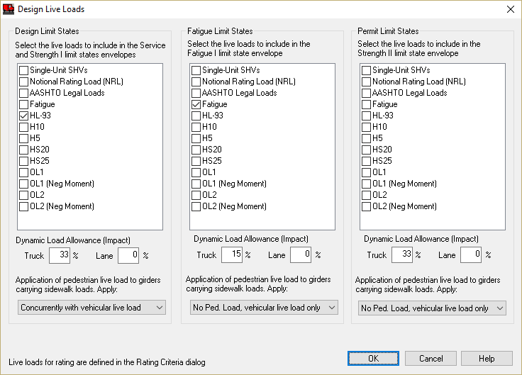

Model Pedestrian Live Load {#tutorial_sidewalks_pedestrian_live_load}
============
Pedestrian live load can be added to this bridge model. The pedestrian live load is considered along with the vehicular live load when a sidewalk is defined. Pedestrian loads can be enveloped or applied concurrently with vehicular live loads.

Select *Loads > Live Loads* to open the Design Live Loads window. In each limit state group there is a drop down box with different options for applying pedestrian live load. For this example, we want to apply the pedestrian live load concurrently with the vehicular live load in the design limit states. To accomplish this, select the options shown below.

