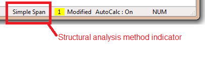

Analysis Controls {#ug_analysis_controls}
==============================================
There are many options that control how analysis, design, specification compliance checking, and load rating are performed. The options can be controlled by the Structural Analysis Method and Project Criteria.

Structural Analysis Method
---------------------------
Three structural analysis methods are available for PGSuper projects. PGSplice projects only use the Simple Spans made Continuous method as described below.

Structural Analysis Method | Description
---------------------------|-----------------
Simple Span | Girders are assumed to be simple spans regardless of the connection boundary conditions  
Simple Spans made Continuous | Girders are treated as simple spans until they are made continuous. Continuity can be achieved before or after deck placement as specified in the connection boundary conditions.  
Envelope of Simple Span and Simple Spans made Continuous | Both of the previous analysis methods are used and their results enveloped. The controlling values are used.

Select *Project > Structural Analysis Method* to set the analysis method. The selected analysis method is always shown in the status bar.

> NOTE: The Structural Analysis Method must be set to Continuous for time-step analysis.

Project Criteria
------------------
Project Criteria controls most every aspect of the analysis, design, specification compliance check, and load rating. It controls the edition of the LRFD specification to be used, the allowable stresses, the loss calculation method, creep and camber parameters, allowable strand stresses, load factors, deflection criteria, design and analysis options and more.

The Project Criteria is defined in the Project Criteria library. Generally, a bridge owner such as a Department of Transportation will create configurations that set up the project criteria in such a way that it reflects their policies and practices. Select *Project > Project Criteria* to choose a particular project criteria to use in your bridge project.

> NOTE: Bridge owners will typically create configurations that set their project criteria as the default.

