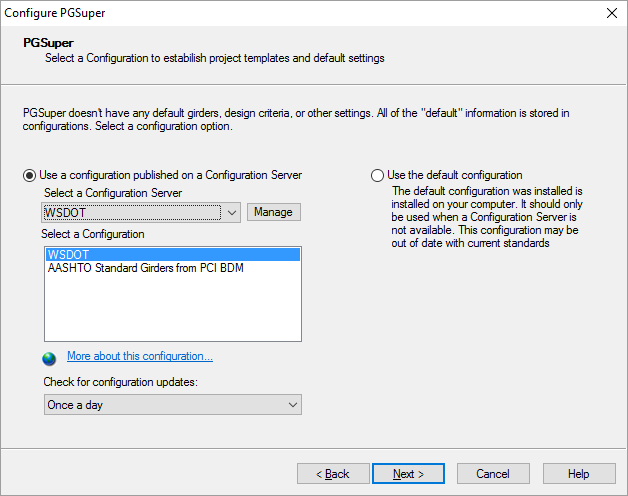
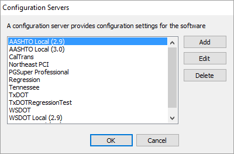

Configurations {#ug_configurations}
==============================================
The functionality of PGSuper can be customized with Configurations. Configurations model standard bridge components such as girders and traffic barriers, as well as the design policies of bridge owners such as State DOTs. 

Bridge owners, such as WSDOT and TxDOT, publish configurations on the Internet so all of their in-house and consulting engineers are using the same information. These configurations customize PGSuper and PGSplice for a specific agency.

Configurations make using PGSuper easy for consulting engineers who work on projects in different states. Simply change the configuration to match your client's DOT and get to work.

> NOTE: PGSuper only come with configurations from WSDOT and TxDOT. Check with your client to see if they publish a configuration for their DOT. Also, there are third party vendors that supply DOT configurations.

A Configuration consists of a Master Library of predefined objects such as girders, barriers, live loads, and project criteria, and Project Templates which define the default settings for new projects.

To change your configuration:
1. Start BridgeLink but do not open any projects.
2. Select *File > Configure BridgeLink...*
3. Press [Next >] until you get to the Configure PGSuper step
4. Select a configuration as described below
5. Press [Next >] to get to the end of the wizard. The wizard steps are configurations for other applications. Refer to the documention for those applications for details.
6. At the end of the wizard, press [Finish] to cause the configurations to be updated.

Configuration Information
-----------------
The information in this group defines the source of the configuration and its details. You can use the default configuration that was installed with the software or you can use any number of different configurations published on a local file system, network file system, or on the Internet. You can change your configuration any time you like.

Option | Description
-------|---------------
Select a configuration published on a Configuration Server | This is typically the option you'll want to use if your organization is doing production work for a bridge owner. By selecting this option, your Configuration is automatically kept up to date at the frequency set in this window.
[Manage] | Press to add, edit, and delete configuration servers.
Select a Configuration | Configuration Servers can have many configuration options. Select a configuration from this list.
More about this configuration... | Click on this hyperlink to open a web site with more information about the selected configuration. 
Update Frequency | The Configuration Server is periodically queried to check for updates. This setting controls the frequency of checking for updates.
Use the default configuration | A default configuration was installed with the software. This is a good place to start if you don't know which configuration to use. Note that this configuration is based on WSDOT settings and they are not automatically kept up to date over the Internet.

### Managing Configurations ###
PGSuper comes pre-configured to use the WSDOT and TxDOT configuration servers. You may want to use your own configuration server (see the @ref administrator_guide to learn how to create your own configuration server), or use servers created by other DOTs or third party vendors. To use these other configuration servers, you must add their definition to PGSuper. 

To add a Configuration Server Definition:
1. Get the definition parameters from the server owner
2. In the Configure PGSuper window, press [Manage]. This will open the PGSuper Configuration Servers window. 
3. Press [Add] to add a new server. You can press [Edit] to change a server definition, or select a server and press [Delete] to remove its definition.
4. In the PGSuper Configuration Server Definition window, enter a name for the server. This can be any name you like. Then select the server type and enter the definition parameters you got from the server owner.
5. Press [OK] to save the server definition. Press [OK] again to close the list of configuration servers.
6. The server you just created will be in the drop down list in the Configure PGSuper window. Select the server. The configuration list will be updated with the configurations published on the server.
