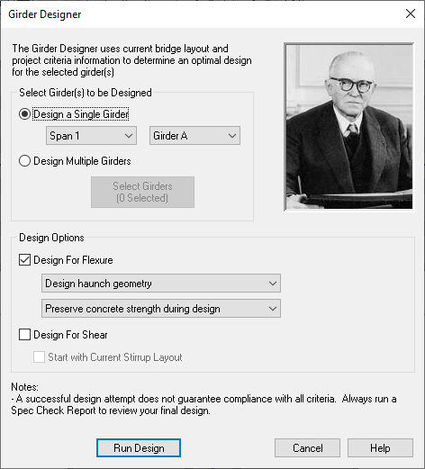
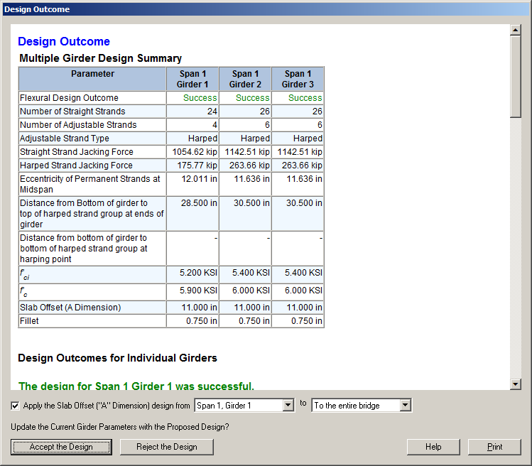

Design {#ug_design}
==============================================
This chapter describes the Girder Designer, which provides automated girder design capabilities.

If you know everything about your structure at the beginning of a project all you have to do is verify it satisfies the design requirements. However, when designing a new structure, life isn't quite so simple. It is your job as the designer to determine many of the attributes of your bridge and its precast-prestressed girders. This is where the Girder Designer comes in.

> NOTE: The Girder Designer is not available when losses are computed by the Time-Step method.

Given a general bridge configuration, girder type, framing plan, and material information, the Girder Designer can make a really good estimate at what the other input parameters should be, including number and configuration of prestressing strands, jacking force, concrete strength, transverse reinforcement and other bridge data. The Girder Designer can evaluate temporary construction conditions including stability during lifting girders from the casting bed and hauling them to the bridge site.

The flow chart below outlines the typical design process.

Design Capabilities
---------------------
There are many parameters involved when designing a precast girder bridge superstructure, including girder spacing, girder size, span length, slab depth, slab overhang width, and concrete strength. In the most general case, you could say, "There's a hole in the ground, design a bridge that spans it". As you can see, design is a very open-ended activity.

The Girder Designer has a more narrow scope. Given basic bridge configuration information, it will make an estimate at what some of the input parameters should be. The Girder Designer can design for flexure and shear.

For flexure, the Girder Designer can determine:
* Prestressing Optimization Strategy (harped design, straight design, or debond design)
* Strand configuration including the number of straight and harped (or adjustable-straight) strands
* Jacking Forces
* Debonding
* Concrete Release Strength, f'ci
* Concrete 28 Day Strength, f'c
* Slab Offset ("A" Dimension)
* Location of Lifting Loops for girder handling
* Location of Truck Support for girder transportation
* Temporary prestressing requirements associated with girder stability

For shear, the Girder Design can determine:
* Vertical Shear Reinforcement
* Horizontal Interface Shear Reinforcement
* Splitting/Bursting Reinforcement
* Confinement Reinforcement
* Longitudinal Reinforcement for Shear 

Designing Girders
-------------------
This section will discuss the mechanics of designing a girder. In practice, designing a girder can be very complex and tedious. In most cases, the Girder Designer does the hard work.

### Using the Girder Designer ###
To use the Girder Designer:
1. Start the Girder Designer by selecting *Project > Design Girder*. This will open the Girder Designer window. 
2. Select girder(s) to design. You can design a single girder or several girders at once.
3. Select your design options. 
4. Press [Run Design] to start the design.

> TIP: You can quickly design a girder by right clicking on it in the Bridge View or the Girder View, and *Design Girder* from the context menu. The girder will be designed using the most recently set options in the Girder Designer window.

When the design finishes, you will be presented with the Design Outcome report.

Reviewing the Design Outcome
-----------------------------
Before you accept design, it is prudent to carefully review the Design Outcome Report. The Design Outcome Report shows a comparison between the parameters that currently define a girder and the once the Girder Designer has determined.

### Accepting/Reject a Design ###
After reviewing the Design Outcome Report, you must decide to accept or reject the Girder Designer's proposed design. Press [Accept the Design] to accept the proposed design and update your bridge model. If you do not want to change your bridge model, press [Reject the Design].

> NOTE: If a slab offset design is selected when designing multiple girders, you will be prompted to select which slab offset design to use for each, or all of the girders in the bridge as shown in the bottom of the figure below. PGSuper will check your haunch design, but formulation of a global slab offset design for all girders in your bridge is left up to you, the engineer.

> TIP: Always run a full specification check (Details Report, or Spec. Check Report) after running a design. Approximations made by the Girder Designer may not satisfy all of the project criteria or the LRFD requirements.

> TIP: The Girder Designer is very good, but not perfect. It may fail even if a successful design is possible. Or, it might be possible to create a "better" design by defining your own girder input, reviewing results, and modifying girder data manually.

Advanced Design Options
------------------------
For most prestress girder designs, strands and/or material properties must be adjusted in order to meet stress requirements near the ends of a girder at release. We refer to this as Prestressing Optimization. The Girder Designer's strategies for prestressing optimization fall into these basic categories:

* Increasing concrete strength
* Debonding of strands
* Harping of strands
* Addition of highly-placed (raised), straight fully-bonded strands along the entire girder length

The choice of one or more optimization strategies depends on the girder type, economic preferences, safety, or other concerns in your local area. For example, local precasters might prefer debonding over harping: So for I-girders an agency might first want to attempt an all-straight fully bonded design using a high strength concrete; if that fails, try a design using debonding and normal strength concrete; and if that fails, try a harped strand design.

### Cascading Prestress Optimization Strategies ###
Prestress Optimization strategies are configured on the @ref ug_library_dialogs_girder_flexural_design tab in Girder Library entries as shown below. Here, you can configure the Girder Designer to attempt different types of prestressing designs in the order shown. 

The design strategies are attempted in the order shown. When a strategy fails, the Girder Designer will proceed to the next strategy until all have been exhausted. Each design strategy has concrete strength limits that define the maximum values of the release and final concrete strengths. If the design requires concrete strengths in excess of these limits the Girder Design will move on to the next strategy.

> TIP: The more strategies you select, the longer it may take to complete a design.

Designing with Transformed Section Properties
---------------------------------------------
Stress analysis can be based on gross or transformed section properties. When transformed section properties are used the area, centroid, and section moduli of the girder change with both time (properties use a modular ratio of Eps/Eci at release and Eps/Ec at final) and the number and configuration of the strands. Concrete strength and strand arrangements are constantly being optimized during the design process causing section properties to change at each iteration. As you can imagine, convergence on a design when transformed section properties are used can be challenging.

When stress analysis is based on transformed section properties, the girder design is based on the section properties at the beginning of the design. Section properties are not updated during design.

To further optimize your design, 
1. Use the Girder Designer to design a girder. The design will be based on the transformed section properties computed from current concrete strengths and prestressing defined for the girder.
2. Create a Spec Check report
3. Review the section titled "Required Concrete Strengths". This section lists the minimum concrete strengths required to satisfy the allowable concrete stress limitations.
4. Update the concrete strength in your girder to the minimum required values obtained from Step 3.
5. Design the girder again. The design will be based on the transformed section properties computed from the concrete strengths defined in Step 4 and the strands determined in Step 1.
6. Repeat until the design as converged.

> TIP: The option whether to use transformed or gross section properties is selected in the @ref ug_library_dialogs_project_criteria, @ref ug_library_dialogs_project_criteria_general tab.
