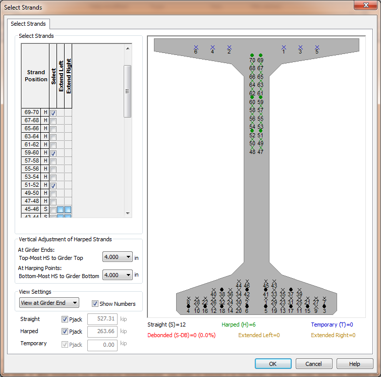
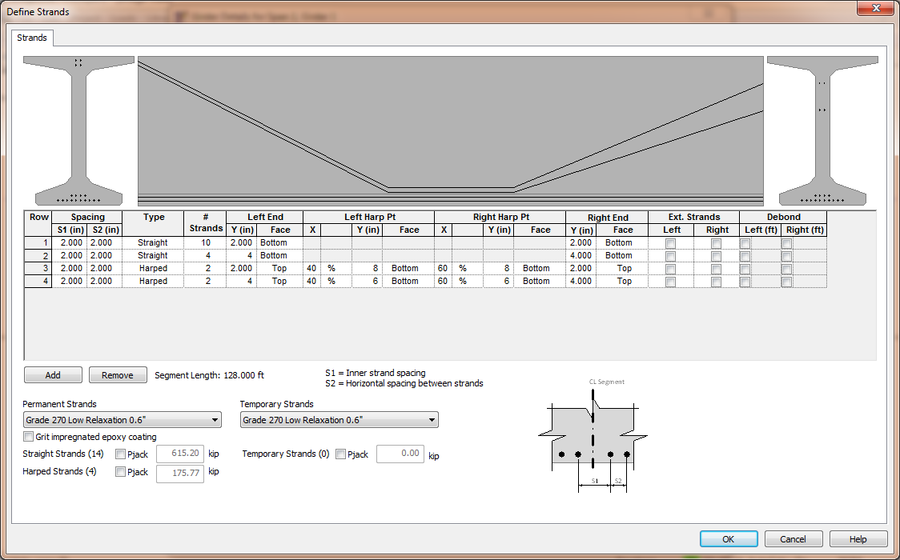

Defining a Girder {#ug_girder_modeling_defining_a_girder}
==============================================
The majority of the information needed to define a girder is stored in the Girder library. This information includes the cross sectional dimensions of the girder, the possible locations of prestressing strands, and standardized arrangements of stirrups and longitudinal reinforcement. Now this information has to be customized for the girders in your project. The following information is needed to complete the definition of the girder:

* the exact girder type
* prestressing configuration including number of strands, jacking forces, debonding, and strand extensions
* concrete material properties
* actual arrangement of stirrups and longitudinal reinforcement
* vertical position of the girder in the final bridge structure with respect to the top bridge deck
* support points while the girder is in the casting bed, during lifting, during storage, and during transportation

This addition information is defined in the Girder Details window.

To define your girder:
1. Select *Edit > Girder...*. This will open the Girder Details window for the selected girder. If a girder is not selected, you will be asked to select a girder for editing.
2. Define the general information on the General tab
3. Define the prestressing configuration on the Strands, Debonding, and Strand Extensions tabs
4. Define the longitudinal reinforcement in the girder on the Long. Reinforcement tab
5. Define the stirrups on the Trans. Reinforcement tab
6. Define the temporary support conditions on the Temporary Conditions tab

> NOTE: Detailed information about all of the input parameters in the @ref ug_dialogs_girder_details window can be found in @ref ug_dialogs.

Prestressing Configuration
---------------------------
The prestressing configuration defines the actual prestressing used in the girder. There are four methods for define the prestressing configuration.

Method | Description 
-------|---------------
Total Number of Permanent Strands | When this option is used, both straight and adjustable strands (harped or straight-web) are filled sequentially using the global strand fill order (Fill #) defined by the Girder library strand grid. This is the method typically used by TxDOT.
Number of Straight and Number Of Harped (or Number of Straight and Adjustable) | The number of straight and adjustable strands are defined independently. Straight and adjustable strand locations are filled sequentially using their relative orders defined in the Girder library strand grid. This is the method typically used by WSDOT.
Direct Selection of Strand Locations | This option allows you to fill the strand locations defined in the Girder library strand grid in any order you like.
Direct Input of Strand Locations | This option allows you to ignore the strand locations defined in the Girder library strand grid and to define strands at any location in the cross section. 

The "Total Number of Permanent Strands" and "Number of Straight and Number of Harped" methods rely on the strand grids defined in the Girder library to determine the location of strands in the cross section. Since bridge owners typically use standardized strand locations in their standardized girder sections, it is sufficient for the design engineer to simply input the number of strands and let the software take care of rest of the details.

The "Direct Selection of Strand Locations" method is very useful when you want to deviate from the two methods that rely on standardized strand locations. You might want to do this when evaluating a contractor proposed design that has the strands positioned in non-standard locations. With this method, you simply select the positions in the pre-defined strand grid where the strands are located. In the figure below, the "X" in the girder section represent possible strand locations in the pre-defined strand grid and the "*" represent locations that have been assigned (or filled with) a strand.

The "Direct Input of Strand Locations" method is also very useful when you want to deviate from the two methods that rely on standardized strand locations. This method differs from the "Direct Selection of Strand Locations" method because the pre-defined strand location grid from the library is not used. You define the location of the strands. In the figure below, two rows of straight strands and two rows of harped strands are defined. Notice that the harped strands have different elevations at each end of the girder.

