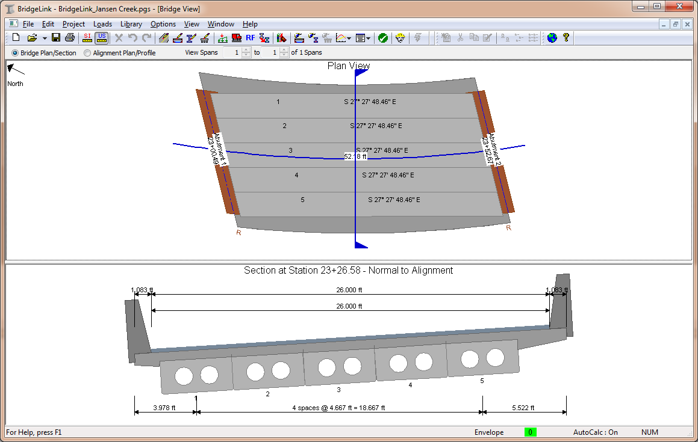

Features and Capabilities {#ug_introduction_features_and_capabilities}
==============================================
PGSuper has an extensive list of features and capabilities. Here we give you the highlights. You'll learn more about the features and capabilities as your read this User Guide and the @ref tutorials.

Features
---------
PGSuper has an extensive list of features. Here is a short list:
* Specification compliance checking for the AASHTO LRFD Bridge Design Specifications
* Load Rating, including automatic load posting analysis, for the AASHTO Manual for Bridge Evaluation
* Customizable project criteria including overrides and deviations from AASHTO provisions
* *Bridge-centric* user interface
* Automated girder designer with multi-strategy design optimization
* Detailed, graphically enhanced reports
* Wide variety of graphical results
* Customizable for all state departments of transportation
* Girder stability analysis for lifting and hauling

Capabilities
-------------------
A wide variety of bridge configurations can be modeled. Here is a short list of the modeling capabilities:

* Complex alignments including horizontal curves with transition spirals, vertical curves, and superelevation transitions.
* Multiple span bridges with simple, integral, and continuous boundary conditions
* Physical models of interior piers
* Complex framing plans including flared (non-parallel) girders and different number and type of girder in each span
* Sidewalks and pedestrian live loads
* User defined vehicles
* Cantilevered spans typically found at elevated intersections
* Many different types of girders include I-Beams, U-Beams, NU-Beams, Deck-bulb Tee, Voided Slabs, and Box Girders

A picture is worth a thousand words, so here are some images that reinforce the capabilities of this software.

 

 

 

 

 

> NOTE: XBRate extension is required for the pier view

