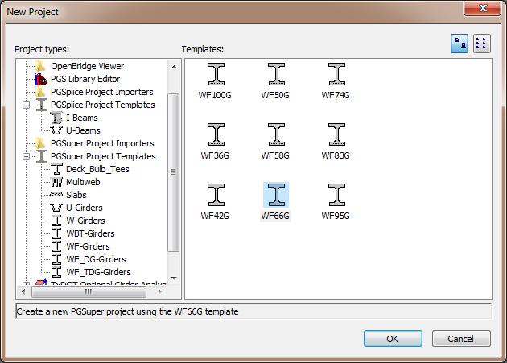

New Projects {#ug_projects_new_projects}
==============================================
New projects are created from Project Templates. Project templates contain default parameters for bridge geometry, components, appurtenances, loading, design criteria, and more.

> NOTE: The project templates define a default project. You can create your own projects templates and customize the starting point for your projects.

Create a New Project
--------------------
1. Select *File > New* to display the New Project window
2. Select a template that is representative of your bridge

Selecting a Template
--------------------
Select PGSuper Project Templates from the New Project window, shown below. The various project types available in BridgeLink are shown in the tree on the left side of the window. Expand the PGSuper Project Templates node in the tree to reveal the groups of templates. Select a template group and the associated templates are shown on the right side of the window. The organization of Project Template Groups may be customized, so the tree on your New Project window might differ for that shown.

> See @ref project_templates in the @ref administrator_guide for details on managing and creating project templates

> TIP: The buttons on the right hand side of the dialog change the appearance of the project template icons. You can display the templates as large icons, small icons, or in a detailed list.

