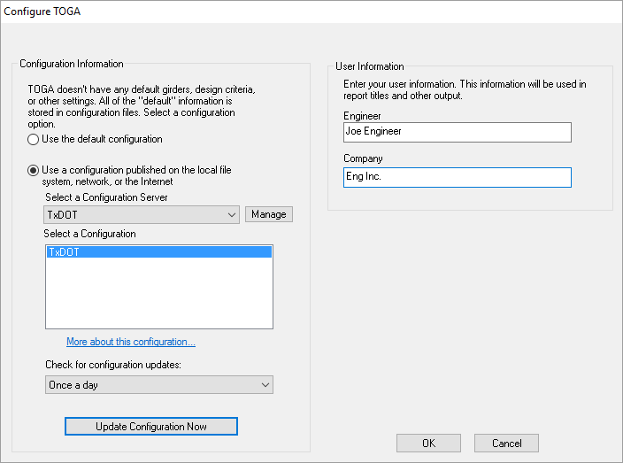
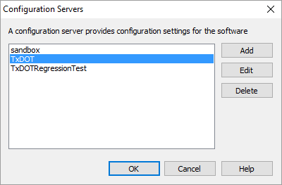

Configurations {#configurations}
==============================================
The functionality of TOGA can be customized with Configurations. Configurations set up TOGA to work with the correct library and PGSuper modelling options, and also provide template files which enable the creation of new TOGA projects. 

A Configuration consists of a the following files which are used in concert to define a TOGA project and analysis:
1. A Master Library containing predefined objects such as girders, barriers, live loads, and project criteria
2. Project Templates (*.togt files) which define the default settings and beam type for new and existing projects
3. The file TogaTemplate.pgs, which defines the PGSuper Template Bridge that all TOGA analses are based on.

To change your configuration:
1. Start BridgeLink but do not open any projects.
2. Select *File > Configure TOGA...*

There are two groups of information that can be set in the Configure TOGA window; Configuration Information and User Information.

Configuration Information
-----------------
The information in this group defines the source of the configuration and its details. You can use the default configuration that was installed with the software or you can use any number of different configurations published on a local file system, network file system, or on the Internet. You can change your configuration any time you like.

Option | Description
-------|---------------
Use the default configuration | The "default configuration" is installed with the software and typically should only be used if you cannot connect to the TxDOT configuration over the Internet. Note that this configuration is based on TxDOT settings when the software was created and is not automatically kept up to date over the Internet.
Use a configuration published on the local file system, network or the Internet | The TxDOT server should be in the list from installation and should be used by most users. You can create your own server if you want to change TOGA's behavior.
Select a Configuration Server | This is the typically the option you'll want to use if your organization is doing production work for a bridge owner (TxDOT) that publishes TOGA configurations. By selecting this option, your Configuration is automatically kept up to date at the frequency set in this window.
Select a Configuration | Configuration Servers can have many configurations. Select a configuration from this list (again, typically TxDOT).
[Manage] | Press to add, edit, and delete configuration servers.
More about this configuration... | Click on this hyperlink to open a web site showing more information about the selected configuration. 
Update Frequency | The Configuration Server is periodically queried to check for new updates. This setting controls the frequency of update checking.

### Managing Configurations ###
TOGA comes pre-configured to use the TxDOT configuration server and most users will want to use that. However, you may want to use your own configuration server, or perhaps use servers created by a third party. To use these other configuration servers, you must add their definition to TOGA. 

To add a Configuration Server Definition:
1. Get the definition parameters from the server owner
2. In the Configure TOGA window, press [Manage]. This will open the TOGA Configuration Servers window. 
3. Press [Add] to add a new server. You can press [Edit] to change a server definition, or select a server and press [Delete] to remove its definition.
4. In the TOGA Configuration Server Definition window, enter a name for the server. This can be any name you like. Then select the server type and enter the definition parameters you got from the server owner. more information can be found at @ref configuration_server_definition
5. Press [OK] to save the server definition. Press [OK] again to close the list of configuration servers.
6. The server you just created will be in the drop down list in the Configure TOGA window. Select the server. The configuration list will be updated with the configurations published on the server. Then select a configuration, and click "Update..." to use it.

Notes on the Default Configuration
-------------------------
During BridgeLink installation, a subfolder called "TogaTemplates" is created below the BridgeLink installation folder. This folder contains the file TxDOT.lbr (libary file), TogaTemplate.pgs (which defines the PGSuper Template Bridge), and the *.togt templates  and icon files used to define the available beam types for TOGA for the default configuration. This allows TOGA to function on computers that do not have Internet access.
 
User Information
------------------
When creating a new project, one of the first things that you will do is supply some basic information about the project. These properties are used to describe a bridge project and to identify the engineer performing the work. Your personal information will be the same for every project. So you don't have to enter your personal information every time you create a new project, you can specify that information in the User Information fields. Enter your name and company in the input fields. This information will be put onto reports and other output.

> NOTE: TOGA is a TxDOT-specific tool. Hence, most users will want to use the configuration published by TxDOT.
