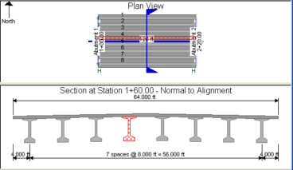
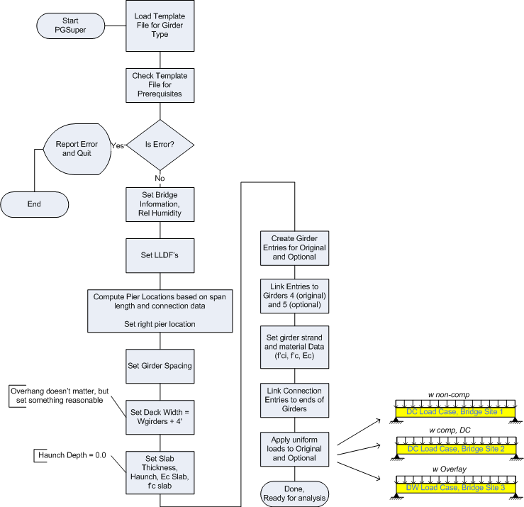

Generation of the PGSuper Model {#model_generation}
========================
As mentioned in previous sections, TOGA builds a PGSuper model internally to perform the optional analysis. This section describes the model and how it is built.

Since barrier loads are input directly into the Optional analysis, an **eight-girder model** is used. (This is because TxDOT distributes barrier loads over the three exterior girders and we don’t want PGSuper to automatically add these). A typical model is shown below.  **Girder 4 models the original design and Girder 5 models the fabricator optional design**.

The first step when generating all TOGA PGSuper models is to load the PGSuper Template Bridge. This is simply a special PGSuper project file that is installed along with TOGA. Administrators can use this file to change the behavior of TOGA see the [Administrator Guide](@ref adminstrator_guide)  for more information.

> Tip: You can export the PGSuper model generated by TOGA from the main menu at File->Export PGSuper Model. **Note that stresses computed in the PGSuper model will not be the same as the factored stresses computed by TOGA. Be very careful when comparing TOGA results with results from the exported PGSuper model.**

To ease maintenance, TOGA uses TxDOT's existing standard master library during model generation and automatically overwrites any library entries that conflict with the master library.

Model Generation Flow Chart
The following flowchart gives the basic flow of model generation. 

 

For precise details, refer to TxDOTOptionalDesignDoc.cpp contained in the PGSuper source code distribution available at http://www.wsdot.wa.gov/eesc/bridge/software/index.cfm?fuseaction=download&software_id=47
