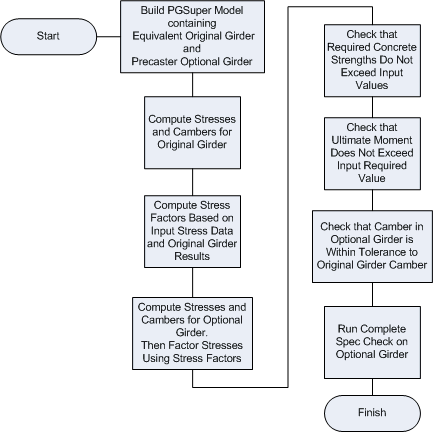

Optional Design Analysis {#optional_design_analysis}
========================
The analysis of fabricator optional designs is intentionally simplified in order to streamline TxDOT approval. This section describes the assumptions and computations made during the TOGA analysis.

The following flowchart outlines the basic analysis. Details for each step are given in the sections below.

Build PGSuper Model
-------------------
TOGA utilizes PGSuper to perform most of the analyses in the Optional Design evaluation. The first step in the analysis process is to build a bridge model with the girders to be analyzed for the Equivalent Original configuration and for the Fabricator Optional girder design. The following pages describe the model building process in detail:

* [Girder Models Used In Analysis](@ref girder_models) - Refer here for nomenclature used in this article
* [Generation of the PGSuper Model](@ref model_generation)

Compute Stresses and Cambers for Equivalent Original Girder
-----------------------------------------------------------
Here we analyze the Equivalent Original PGSuper girder model to determine maximum stresses, required ultimate moment, and final girder camber.

Compute Stress Factors and Apply to Fabricator Optional Design
--------------------------------------------------------------
Since we do not know the exact configuration of the Per-Plan design, there is uncertainty whether the Equivalent Original model is an accurate representation of the Per-Plan Model. This uncertainly applies especially to the accuracy of applied loads. But, we do know the exact Per-Plan maximum stresses due to non-prestress loads from the <a href="girder_models.html#input_response_data">Input_Response_Data</a>. Therefore, an Input/Analysis stress ratio can be determined from the maximum stresses due to non-prestressing loads computed from the Equivalent Original design. This stress ratio could then be applied to the Equivalent Original Girder analysis results to give a better approximation of the Per-Plan response.

The purpose of the  Equivalent Original Girder analysis model is to calibrate the responses for the Fabricator Optional analysis. Since the configuration of the Equivalent Original Girder analysis model is identical to that of the Fabricator Optional Design, except for strand and girder materials, it makes sense to apply the same stress ratios to Fabricator Optional Design in order to achieve a better approximation of the actual response. This is exactly how stress factors are used in TOGA.

If the stress factor for either top stress or bottom stress is less than 1.0. A "Design Deficiency" warning is reported.

> Note that stress factors are only used in stress computations internal to TOGA and not for any other part of the analysis. **This means that stress results from exported PGSuper files WILL NOT match TOGA stress results. Be very careful when comparing these, or other, values.**

Check Input Concrete Strength
-----------------------------
Once stresses in the Fabricator Optional Design have been factored, required concrete strengths for all applicable LRFD limit states can be computed. "Beam Does not Satisfy Design Requirements" will be reported if either f'ci or f'c from the <a href="girder_models.html#input_response_data">Input_Response_Data</a> are inadequate.

Check Ultimate Moment
---------------------
The ultimate moment capacity at the mid-span of the Fabricator Optional girder is computed using a strain compatibility analysis. This capacity is compared against two demand values:

1. Mu, the required ultimate moment capacity from the <a href="girder_models.html#input_response_data">Input_Response_Data</a>. If the girder strength is inadequate, "Beam Does not Satisfy Design Requirements" will be reported
2. Mu, the required ultimate moment computed in the Equivalent Original PGSuper girder model . A failure here results in a  "Design Deficiency" warning.

Check Camber
------------
Maximum final camber values are computed for the Equivalent Original Girder and Fabricator Optional Design. A "Design Deficiency" warning is reported If the camber for the Fabricator Optional Design violates a tolerance of +/- 1/2 in (0.0417 ft) compared with analysis of the Equivalent Original Girder.

Run Complete Specification Check
--------------------------------
The last analysis step is to run a complete Specification Check for the Fabricator Optional Design girder. Any failures will be reported in the Short Form Report. More details about design failures can be found in the Long Form Report. Refer to PGSuper's Theoretical Manual for a detailed description of specification checking.

> Tip: If additional details about design failures and computations are needed, export the TOGA data to PGSuper and run a Details report.

