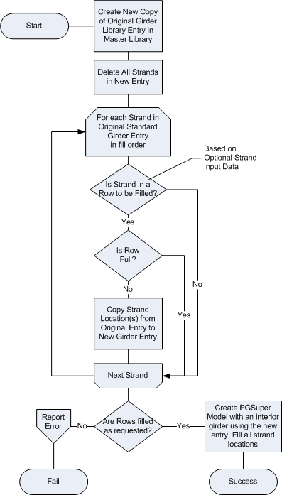

Row-Based Strand Fill {#strand_fill}
========================
Seasoned PGSuper users might notice that TOGA has an option to fill prestressing strands using a strands per row definition, and that PGSuper does not. In the current version of PGSuper, you can only fill strands using number of strands which are placed based on the fill order defined in the girder library entry. TOGA is really just a client program to PGSuper, so how can TOGA do what PGSuper cannot? As in most stories of "to good to be true", we had to resort to trickery...

TOGA creates a PGSuper model that appears to have row-based strand filling by first making a copy of the girder library entry and then manipulating the strand fill order to get the desired pattern. You can see this by exporting a TOGA model with row-base fill to PGSuper and examining the girder library. Names of the copied entries are in the format \"<i>Name_Original</i>\" or \"<i>Name_</i>PcOptional\", for the Original Girder Model or Fabricator Optional Girder Model respectively; where, *Name* is the library entry that was copied.

The flowchart below shows a rough outline of the strand fill creation process.

