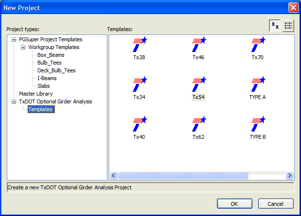

Getting Started {#getting_started}
===================
TOGA is the software that TxDOT's Bridge Fabrication Branch uses to analyze fabricator optional designs. TOGA is a BridgeLink Application that provides a streamlined user interface for optional design evaluation.

[Refer here for TOGA Installation](@ref installation)

Creating a new project in TOGA is simple: Open BridgeLink and select *File > New* from the main menu. The following dialog comes up. Then,
1. Select the project type "TxDOT Optional Girder Analysis" - Templates in the tree control in the left panel.
2. Select the appropriate girder type for your project to open a new TOGA project for that girder, and click [OK].

> Note: If "TxDOT Optional Girder Analysis" is not an available project type, you probably don't have the TxDOT Extensions (which include TOGA) installed. Re-install BridgeLink with the TxDOT options enabled, or contact technical support if this problem persists.

After you have a new file, running TOGA is simple: 
1. Fill in all of the blank input controls on the [Bridge Input Tab](@ref ui_bridge_input_tab) and [Girder Input Tab ](@ref ui_girder_input_tab)
2. Inspect the [Girder View Tab](@ref ui_girder_view_tab)  to verify strand input, 
3. Then visit the [Analysis Report Tab](@ref ui_analysis_report_tab) to review the analysis results.
4. Interpret the results and make your decision. Sorry, no help on this one - you're the expert!

Refer to the [User Interface Guide](@ref ui) for more information about using TOGA

