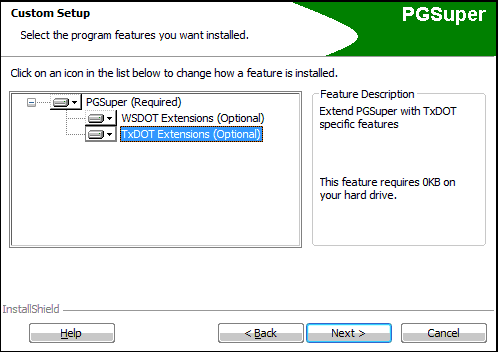

Installation and Troubleshooting {#installation}
===================

Installation
-------------
> Note: If you work at TxDOT, TOGA and PGSuper will be installed and configured automatically on your workstation by TSD so you can disregard this section.

TOGA is installed along with the main PGSuper installation and is part of the TxDOT Extensions. During installation, you will see a dialog that looks like:

### *Make sure the TxDOT Extensions are enabled or you will not be able to run TOGA.*

TOGA Configurations
-------------------
At BridgeLink installation, TOGA will be configured to access the TxDOT configuration on TxDOT's Internet ftp server. This is the recommended configuration for most users since it is published by TxDOT and will automatically update itself each time you run TOGA. 

If you have problems, you may need to configure TOGA manually as follows:

1. Make sure your computer is connected to the Internet; and your firewall software, if any, allows the program BridgeLink.exe to access the Internet.
2. Run BridgeLink from the Windows Start Menu
3. Select *File > Configure BridgeLink* to open the Configure TOGA dialog
4. Select "Use libraries and templates published on...."
5. Click on the server list - TxDOT should be an option. Select TxDOT.
6. Select the TxDOT libraries and templates package.
7. Click the [Update Libraries and Templates] button or [OK]. BridgeLink should download the configuration files from the TxDOT server.
8. You should now be able to open .toga files and create new TOGA templates

Troubleshooting
---------------
In order to use TOGA, BridgeLink must be configured per the sections above. In most cases, TOGA should work without problems, however problems can occur. Below are some possible scenarios.

### The girder/connection with name: #### does not exist in the master library
This can happen if you are attempting to modify TOGA by creating your own .toga template files. Remember that library entry names are case sensitive.

### Project Criteria Entry Not Found
If this happens, a dialog is presented with the message: \"<i>The Project Criteria library entry with the name $$$ that was originally selected and saved in this TOGA project file does not exist in the current PGSuper Master Library...</i>\" You are then asked to select another Project Criteria entry. If this happens it is most likely that have a very old TOGA project file that references a TxDOT Project Criteria entry that has been removed from the master library file on TxDOT's web server. Contact TxDOT PGSuper support for advice on which current library entry to select.

### The TxDOT Server Does Not Appear in the Libraries and Templates list on the Configure TOGA Dialog
This means that the PGSuper.exe program cannot see TxDOT's ftp server over the internet. Here are some possible causes in order of likelihood: 

1. Your computer is not connected to the Internet. Use your web browser to check http://www.dot.state.tx.us  
2. Firewall software on your computer  is blocking PGSuper.exe from accessing the Internet. Check your firewall configuration or contact your System Admin
3. The TxDOT ftp server is down. Use a client ftp program (e.g., FileZilla) to test an anonymous connection ftp://ftp.dot.state.tx.us/pub/txdot-info/brg/pgsuper/ 
   If no connection, try again later
4. A network/Internet error is blocking access to the TxDOT ftp server. Try again later or use an alternate Internet access method (e.g., wired connection, or cell phone tether).
5. If all else fails, contact [Support](@ref support)

Another fix is to select the Default TOGA configuration from the Configure TOGA dialog. This uses a configuration that is installed onto your hard drive at installation time, and will not be updated if TxDOT makes changes to their libraries. This may be considered a "last ditch" option to get the program running.

> Final Note: You can learn much more about TOGA Configurations in the @ref adminstrator_guide