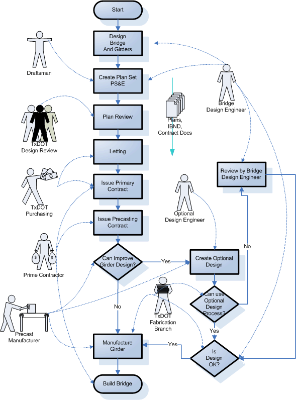

Background {#background}
========================
In most bridge engineering departments the bridge design engineer is responsible for dealing with any design changes. This can generate a large amount of contract paperwork and consume a considerable amount of engineering resources. Prestressed "Optional Design" is a value engineering part of TxDOT's PS&E process that provides a streamlined way for precast fabricators to modify girder concrete strengths and strand layouts for depressed strand designed beams and submit their designs to TxDOT's bridge division for checking.

The Optional Design process utilizes a very limited subset of bridge and girder data to describe a precast-prestress bridge girder and perform an LRFD specification check. TOGA is the software that TxDOT's Fabrication Branch uses to analyze fabricator optional designs.

Note that nearly all Optional Designs are performed on precast I sections, so TOGA only handles I sections.

Problem Description
===================
TxDOT implements a high degree of standardization when designing precast girder bridges. This allows a streamlined girder design process that gives them best-in-class levels of design consistency and low project costs. However, there are situations where standard designs do not provide an optimal solution for girder design, or for the precast manufacturer. The Optional Design process allows these situations to be dealt with without a major disruption in work flow. In many cases fabricator optional designs are able to pass through the process without the need for the original bridge design engineer.

The Optional Design Process
===========================
The work flow diagram below provides a very rough description of those parts of TxDOT Bridge PS&E process salient to Optional Design

