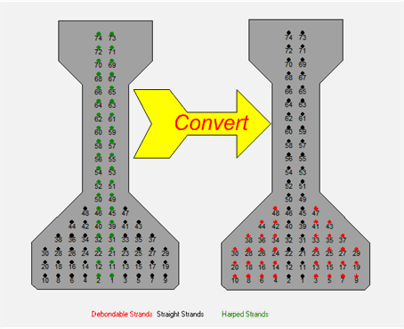

Conversion of Depressed Strands for Direct Fill {#strand_conversion}
========================
Depresssed strands must be converted to straight strands when the Direct Fill of Straight Strands option is selected on the Girder Input page. The schematic below shows how this is done.

The basic rules for strand conversion are as follows:

* Strand locations are taken at the ends of the girder
* All depressed strand locations are converted to straight, non-debondable
* Straight strand locations are made debondable

Note that no detailing checks are made in the user interface. It is up to the user to make sure that debonding limits and detailing rules are followed.

